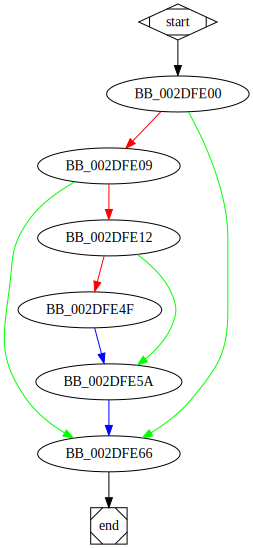

# HandlerProc function

## Description

This function is the *Service Control Handler* procedure. This handler is registered by the function [`sub_2DFE80`](sub_2DFE80.md).
This handler changes the status of the service from `SERVICE_RUNNING` to `SERVICE_STOP_PENDING`.

## Syntax

```c
LPHANDLER_FUNCTION LphandlerFunction;

void LphandlerFunction(
  DWORD dwControl
)
{...}
```

## Source

Go to [source](../cc/HandlerProc.cc).

## Arguments

* `dwControl` : 

## Return Value

None.

## Dependencies

* Function dependencies:
  * [`SetServiceStatus`<sup>Docs</sup>](https://docs.microsoft.com/en-us/windows/win32/api/winsvc/nf-winsvc-setservicestatus)
  * [`OutputDebugStringW`<sup>Docs</sup>](https://docs.microsoft.com/en-us/windows/win32/api/debugapi/nf-debugapi-outputdebugstringw)
  * [`SetEvent`<sup>Docs</sup>](https://docs.microsoft.com/en-us/windows/win32/api/synchapi/nf-synchapi-setevent)

## Graph



## Flow

```c
BB_002DFE00:
//...
if (condition) {
  BB_002DFE09:
  //...
  if (condition) {
    BB_002DFE12:
    //...
    if (condition) {
      BB_002DFE4F:
      //...
    }
    BB_002DFE5A:
    //...
  }
}
BB_002DFE66:
//...
```

## Pseudo-code

### BB_002DFE00

```c
dwControl -= 1;
if (dwControl == 0) {
  //BB_002DFE09
  //...
}
//BB_002DFE66
//...
```

### BB_002DFE09

```c
if (ServiceStatus.dwCurrentState == 4) {
  //BB_002DFE12
  //...
}
//BB_002DFE66
//...
```

### BB_002DFE12

```c
ServiceStatus.dwControlsAccepted = 0;
ServiceStatus.dwCurrentState = 3;
ServiceStatus.dwWin32ExitCode = 0;
ServiceStatus.dwCheckPoint = 4;
v1 = SetServiceStatus(hServiceStatus, &ServiceStatus);
if (v1 == 0) {
  //BB_002DFE4F
  //..
}
//BB_002DFE5A
//...
```

### BB_002DFE4F

```c
OutputDebugStringW(OutputString);
//BB_002DFE5A
//...
```

### BB_002DFE5A

```c
v2 = SetEvent(hHandle);
//BB_002DFE66
//...
```

### BB_002DFE66

```c
return;
//end
```
