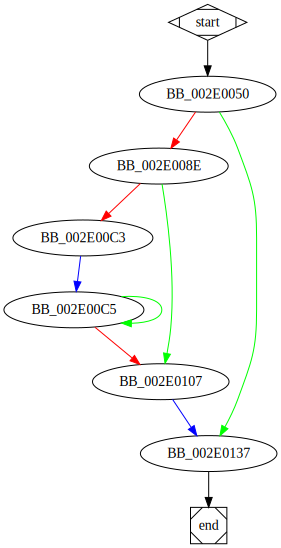

# StartAddress function

## Tasks

- [X] Add Description.
- [X] Add Syntax.
- [X] Add Assembly.
- [X] Add Source.
- [X] Add Arguments.
- [X] Add Return Value.
- [X] Add Dependencies.
- [X] Add Used By.
- [X] Add Graph.
- [X] Add Flow.
- [X] Add Pseudo-code.
- [ ] Fully documented (Including dependencies).

## Description

This function represents a *Thread Procedure* that is created from the function [`sub_2DFE80`](sub_2DFE80.md).

## Syntax

```c
typedef DWORD (__stdcall *LPTHREAD_START_ROUTINE) (  
    [in] LPVOID lpThreadParameter  
);
```

## Assembly

Go to [assembly](../asm/StartAddress.asm).

## Source

Go to [source](../cc/StartAddress.cc).

## Arguments

* `lpThreadParameter` : 

## Return Value

`DWORD` : 

## Dependencies

* Function dependencies:
  * [`WaitForSingleObject`<sup>Docs</sup>](https://docs.microsoft.com/en-us/windows/win32/api/synchapi/nf-synchapi-waitforsingleobject)
  * [`sub_2DF650`](sub_2DF650.md)
  * [`sub_2DEE40`](sub_2DEE40.md) ✅
  * [`sub_2D6A50`](sub_2D6A50.md) ✅
  * [`sub_2DD790`](sub_2DD790.md) ✅
  * [`sub_2DD0D0`](sub_2DD0D0.md) ✅
  * [`sub_2DFB20`](sub_2DFB20.md) ⌛
  * [`sub_2E2A70`](sub_2E2A70.md) ⌛

* Data dependencies:
  * [`hHandle`](hHandle.md) ⌛
  * [`lpServiceName`](lpServiceName.md) ⌛

## Used By

* Used by functions:
  * [`sub_2DFE80`](sub_2DFE80.md)

## Graph



## Flow

```c
BB_002E0050:
//...
if (condition) {
  BB_002E008E:
  //...
  if (condition) {
    BB_002E00C3:
    //...

    do {
      BB_002E00C5:
      //...
    } while(condition);

  }
  BB_002E0107:
  //...
}
BB_002E0137:
//...
```

## Pseudo-code

### BB_002E0050

```c
v1 = WaitForSingleObject(hHandle, 0);
if (v1 != 0) {
  //BB_002E008E
  //...
}
//BB_002E0137
//...
```

### BB_002E008E

```c
v2 = sub_2DF650();
v3 = &var_1C;
v4 = sub_2DEE40(v3);
var_4 = 0;
v6 = 0x2AAAAAAB;
v7 = var_18;
v8 = 0;
v9 = var_1C;
v10 = v7 - v9;
v11 = v10 * v6;
v12 = v11 & 0xFFFFFFFF;
v13 = v11 >> 32;
v14 = v13 >> 2;
v15 = v14;
v16 = v15 >> 0x1F;
v17 = v16 + v14;
if (v17 != 0) {
  //BB_002E00C3
  //...
}
//BB_002E0107
//...
```

### BB_002E00C3

```c
v18 = 0;
//BB_002E00C5
//...
```

### BB_002E00C5

```c
do {
  //BB_002E00C5
  v19 = _alloca(0x18);
  v20 = v18 + v9; //variables v18, v9 need propagation
  v21 = v19;
  var_10 = v19;
  v22 = sub_2D6A50(v20);
  var_4 = 1;
  var_4 = 0;
  v23 = sub_2DD790();
  v24 = var_18;
  v25 = v18 + 0x18;
  v18 = v25; //propagate v18 due to reuse and modification by BB_002E00C5
  v26 = var_1C;
  v9 = v26; //propagate v9 due to reuse and modification by BB_002E00C5
  v27 = 0x2AAAAAAB;
  v28 = v24 - v26;
  v29 = v8 + 1; //variable v8 needs propagation
  v8 = v29; //propagate v8 due to resue and modification by BB_002E00C5
  v30 = v27 * v28;
  v31 = v30 & 0xFFFFFFFF;
  v32 = v30 >> 32;
  v33 = v32 >> 2;
  v34 = v33;
  v35 = v34 >> 0x1F;
  v36 = v35 + v33;
} while(v29 < v36);
//BB_002E0107
//...
```

### BB_002E0107

```c
v37 = dword_357290 >= 8;
v38 = lpServiceName;
v39 = v37 ? v38: lpServiceName; //phi
v40 = sub_2DD0D0(v39);
v41 = sub_2DFB20();
var_4 = 0xFFFFFFFF;
v42 = &var_1C;
v43 = sub_2E2A70(v42); //UnknownObject.sub_2E2A70(...)
//BB_002E0137
//...
```

### BB_002E0137

```c
v44 = 0;
return v44;
//end
```
