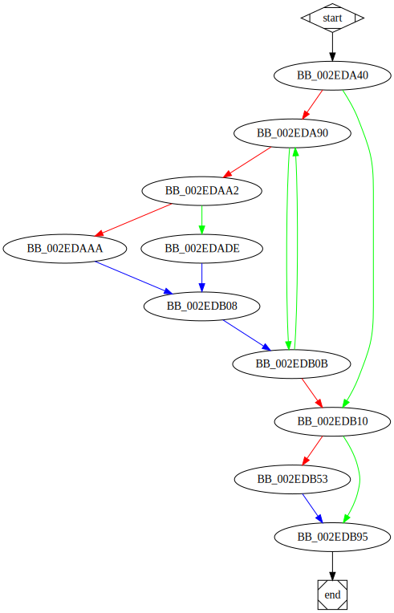

# \_main function

## Tasks

- [X] Add Description.
- [X] Add Syntax.
- [X] Add Assembly.
- [ ] Add Source.
- [X] Add Arguments.
- [X] Add Return Value.
- [ ] Add Dependencies.
- [ ] Add Used By.
- [X] Add Graph.
- [ ] Add Flow.
- [ ] Add Pseudo-code.
- [ ] Fully documented (Including dependencies).

## Description

This is the main function.

## Syntax

```c
int _main(int argc, char**argv)
{...}
```

## Assembly

Go to [assembly](../asm/_main.asm).

## Source

Go to [source](../cc/_main.cc).

## Arguments

* `argc` : The count of `main` arguments.
* `argv` : The values of `main` arguments.

## Return Value

`int` : 

## Dependencies

* Function dependencies:
  * [`sub_2D7040`](sub_2D7040.md) ⌛
  * [`sub_2D6B90`](sub_2D6B90.md) ⌛
  * [`sub_2DAEA0`](sub_2DAEA0.md) ⌛
  * [`sub_2D9610`](sub_2D9610.md) ⌛
  * [`sub_2D4AA0`](sub_2D4AA0.md) ⌛
  * [`sub_2E6F10`](sub_2E6F10.md) ⌛
  * [`unknown_libname_1`](unknown_libname_1.md) ⌛
  * [`sub_2DAF20`](sub_2DAF20.md) ⌛
  * [`sub_2DA410`](sub_2DA410.md) ⌛
  * [`sub_2D26D0`](sub_2D26D0.md) ⌛
  * [`sub_2D26A0`](sub_2D26A0.md) ⌛
  * [`sub_2DA8D0`](sub_2DA8D0.md) ⌛
  * [`sub_2DC5A0`](sub_2DC5A0.md) ⌛

* Data dependencies:
  * ...

## Used By

* Used by functions:
  * ...


## Graph




## Flow

(Add flow.)

## Pseudo-code

(Add pseudo-code.)

