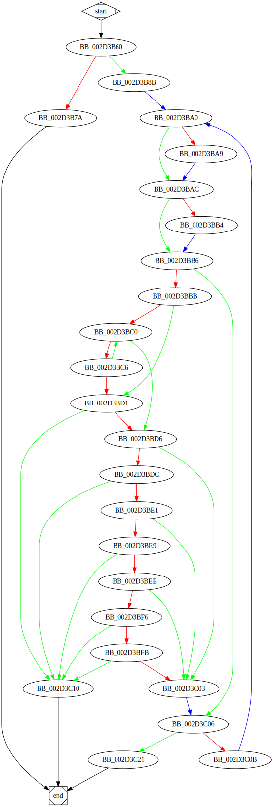

# sub_2D3B60 function

## Description

This function is a method of an unknown object.

## Arguments

* `Object` : An object of an unknown class.

## Return Value

(Add return value.)

## Dependencies

* Function dependencies:
  * None.

## Graph



## Pseudo-code

### BB_002D3B60

```c
v1 = Object->Field18;
v2 = v1 & arg_8;
v3 = Object->Field0C;
v4 = Object->Field04;
v5 = v3 + v2*8;
v6 = v5->Field04;
if (v6 == v4) {
  //BB_002D3B7A
  //...
}
```

### BB_002D3B7A

```c
v7 = arg_0;
v7->Field00 = v4;
v7->Field04 = 0;
return;
```

### BB_002D3B8B

```c
v8 = v5->Field00;
v9 = arg_4;
arg_8 = v8;
v10 = v9->Field10;
//BB_002D3BA0
//...
```

### BB_002D3BA0

```c
v11 = v6->Dword1C >= 0x10;
v12 = &v6->Dword08;
if (v11) {
  //BB_002D3BA9
  //...
}
//BB_002D3BAC
//...
```

### BB_002D3BA9

```c
v13 = v6->Dword08;
//BB_002D3BAC
//...
```

### BB_002D3BAC

```c
v14 = v11 ? v13: v12; //v14 = phi(v12, v13) : This variable depends on the branch that was taken.
v15 = v9->Dword14 >= 0x10;
v16 = v9;
if (v15) {
  //BB_002D3BB4
  //...
}
//BB_002D3BB6
//...
```

### BB_002D3BB4

```c
v17 = v9->Dword00;
//BB_002D3BB6
//...
```


