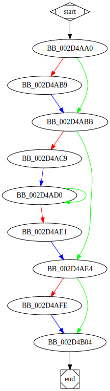

# sub_2D4AA0 function

## Description

## Arguments

## Return Value

(Add return value.)

## Dependencies

* Function dependencies:
  * [`sub_2D3B60`](sub_2D3B60.md)

## Used By

* Used by functions:
  * [`_main`](_main.md)

## Graph

