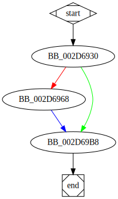

# sub_2D6930 function

## Tasks

- [ ] Add Description.
- [ ] Add Syntax.
- [X] Add Assembly.
- [ ] Add Source.
- [ ] Add Arguments.
- [ ] Add Return Value.
- [X] Add Dependencies.
- [X] Add Used By.
- [X] Add Graph.
- [ ] Add Flow.
- [ ] Add Pseudo-code.
- [ ] Fully documented (Including dependencies).

## Description

(Add description.)

## Syntax

(Add syntax.)

## Assembly

Go to [assembly](../asm/sub_2D6930.asm).

## Source

Go to [source](../cc/sub_2D6930.cc).

## Arguments

(Add arguments.)

## Return Value

(Add return value.)

## Dependencies

* Function dependencies:
  * [`sub_2E8D00`](sub_2E8D00.md) ❓

* Data dependencies:
  * [`unk_340FC8`](unk_340FC8.md) ⌛
  * [`unk_340FD0`](unk_340FD0.md) ⌛
  * `??_7ios_base@std@@6B@`
  * `??_7?$basic_ios@DU?$char_traits@D@std@@@std@@6B@`
  * `??_7?$basic_istream@DU?$char_traits@D@std@@@std@@6B@`
  * `??_7?$basic_ostream@DU?$char_traits@D@std@@@std@@6B@`
  * `??_7?$basic_iostream@DU?$char_traits@D@std@@@std@@6B@`

## Used By

* Used by functions:
  * [`sub_2D67A0`](sub_2D67A0.md)

## Graph

## Flow

(Add flow.)

## Pseudo-code

(Add pseudo-code.)

