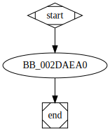

# sub_2DAEA0 function

## Description

## Arguments

* `arg_0` : The first argument.

## Return Value

(Add return value.)

## Dependencies

* Function dependencies:
  * [`sub_2D42B0`](sub_2D42B0.md)

## Graph

