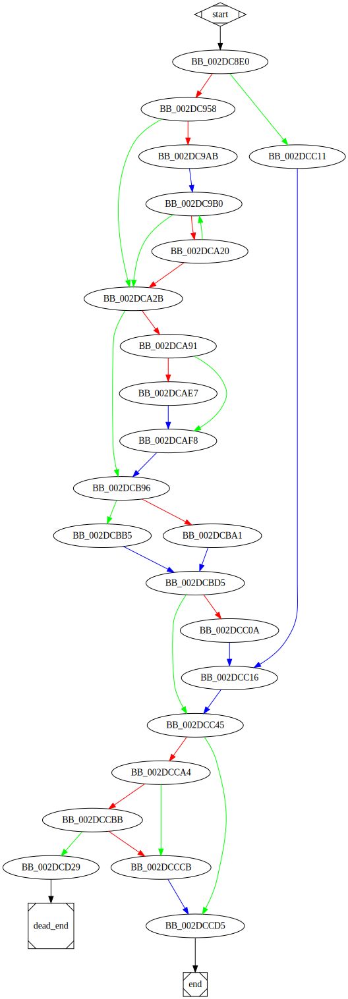

# sub_2DC8E0 function

## Tasks

- [ ] Add Description.
- [ ] Add Syntax.
- [X] Add Assembly.
- [ ] Add Source.
- [ ] Add Arguments.
- [ ] Add Return Value.
- [X] Add Dependencies.
- [X] Add Used By.
- [X] Add Graph.
- [ ] Add Flow.
- [ ] Add Pseudo-code.
- [ ] Fully documented (Including dependencies).

## Description

(Add description.)

## Syntax

(Add syntax.)

## Assembly

Go to [assembly](../asm/sub_2DC8E0.asm).

## Source

Go to [source](../cc/sub_2DC8E0.cc).

## Arguments

(Add arguments.)

## Return Value

(Add return value.)

## Dependencies

* Function dependencies:
  * [`OpenServiceW`Docs](https://docs.microsoft.com/en-us/windows/win32/api/winsvc/nf-winsvc-openservicew)
  * [`sub_2D6BD0`](sub_2D6BD0.md) ✔️
  * [`sub_2D26D0`](sub_2D26D0.md) ✔️
  * [`sub_2ED330`](sub_2ED330.md) ❓
  * [`sub_2EAB20`](sub_2EAB20.md) ❓
  * [`sub_2E76E0`](sub_2E76E0.md) ❓
  * [`ControlService`Docs](https://docs.microsoft.com/en-us/windows/win32/api/winsvc/nf-winsvc-controlservice)
  * [`sub_2DA700`](sub_2DA700.md) ❓
  * [`Sleep`Docs](https://docs.microsoft.com/en-us/windows/win32/api/synchapi/nf-synchapi-sleep)
  * [`QueryServiceStatusEx`Docs](https://docs.microsoft.com/en-us/windows/win32/api/winsvc/nf-winsvc-queryservicestatusex)
  * [`GetServiceDisplayNameW`Docs](https://docs.microsoft.com/en-us/windows/win32/api/winsvc/nf-winsvc-getservicedisplaynamew)
  * [`sub_2E3C90`](sub_2E3C90.md) ✔️
  * [`sub_2E2C40`](sub_2E2C40.md) ✔️
  * [`sub_2D2910`](sub_2D2910.md) ❓
  * [`sub_2D3F20`](sub_2D3F20.md) ❓
  * [`sub_2D4940`](sub_2D4940.md) ⌛
  * [`DeleteService`Docs](https://docs.microsoft.com/en-us/windows/win32/api/winsvc/nf-winsvc-deleteservice)
  * [`GetLastError`Docs](https://docs.microsoft.com/en-us/windows/win32/api/errhandlingapi/nf-errhandlingapi-getlasterror)
  * [`CloseServiceHandle`Docs](https://docs.microsoft.com/en-us/windows/win32/api/winsvc/nf-winsvc-closeservicehandle)
  * [`CreateServiceW`Docs](https://docs.microsoft.com/en-us/windows/win32/api/winsvc/nf-winsvc-createservicew)
  * [`sub_30851F`](sub_30851F.md) ⌛
  * [`@__security_check_cookie@4`](@__security_check_cookie@4.md) ⌛
  * [`__invalid_parameter_noinfo_noreturn`](__invalid_parameter_noinfo_noreturn.md) ⌛

* Data dependencies:
  * [`aExistingServic`](aExistingServic.md) ⌛
  * [`unk_359670`](unk_359670.md) ⌛
  * [`aServiceStatus`](aServiceStatus.md) ⌛
  * [`aServiceProcess`](aServiceProcess.md) ⌛
  * [`aStolenName`](aStolenName.md) ⌛
  * [`unk_359720`](unk_359720.md) ⌛
  * [`aServiceDeleted`](aServiceDeleted.md) ⌛
  * [`aServiceCannotB`](aServiceCannotB.md) ⌛
  * [`aCannotCloseHan`](aCannotCloseHan.md) ⌛
  * [`aChoosenService`](aChoosenService.md) ⌛

## Used By

* Used by functions:
  * [`sub_2DC5A0`](sub_2DC5A0.md)

## Graph

## Flow

(Add flow.)

## Pseudo-code

(Add pseudo-code.)
