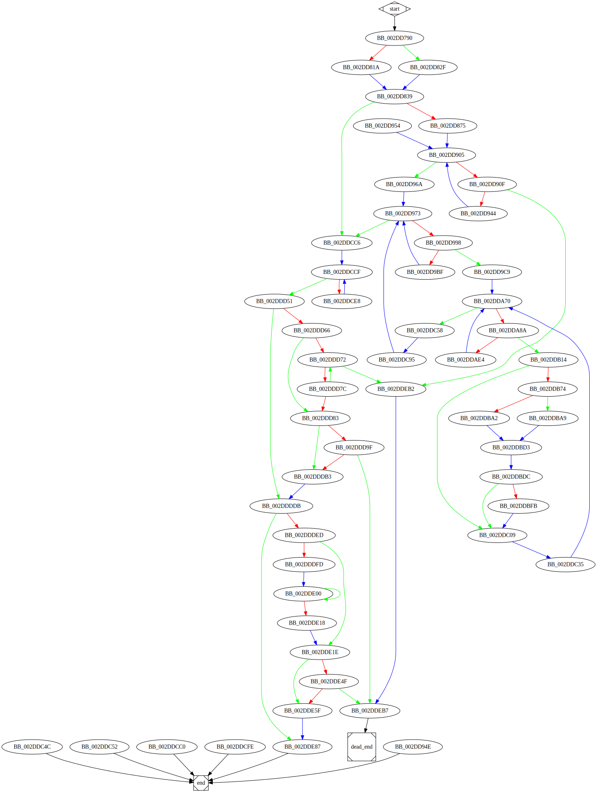

# sub_2DD790 function

## Tasks

- [ ] Add Description.
- [ ] Add Syntax.
- [X] Add Assembly.
- [ ] Add Source.
- [ ] Add Arguments.
- [ ] Add Return Value.
- [X] Add Dependencies.
- [X] Add Used By.
- [X] Add Graph.
- [ ] Add Flow.
- [ ] Add Pseudo-code.
- [ ] Fully documented (Including dependencies).

## Description

(Add description.)

## Syntax

(Add syntax.)

## Assembly

Go to [assembly](../asm/sub_2DD790.asm).

## Source

Go to [source](../cc/sub_2DD790.cc).

## Arguments

(Add arguments.)

## Return Value

(Add return value.)

## Dependencies

* Function dependencies:
  * `??2@YAPAXI@Z`
  * [`sub_2D24F0`](sub_2D24F0.md) ❓
  * [`sub_2E7120`](sub_2E7120.md) ✅
  * [`sub_2E2C40`](sub_2E2C40.md) ✅
  * [`sub_2EA990`](sub_2EA990.md) ❓
  * [`sub_2DAEC0`](sub_2DAEC0.md) ❓
  * [`sub_2DCD30`](sub_2DCD30.md) ❓
  * [`unknown_libname_5`](unknown_libname_5.md) ✅
  * [`sub_2D2410`](sub_2D2410.md) ✅
  * [`sub_2EAAD0`](sub_2EAAD0.md) ❓
  * [`Sleep`Docs](https://docs.microsoft.com/en-us/windows/win32/api/synchapi/nf-synchapi-sleep)
  * [`sub_2E3DA0`](sub_2E3DA0.md) ❓
  * [`sub_2D8B20`](sub_2D8B20.md) ❓
  * [`sub_2DF520`](sub_2DF520.md) ✅
  * [`sub_2D7BC0`](sub_2D7BC0.md) ❓
  * [`sub_2D7B50`](sub_2D7B50.md) ❓
  * [`sub_2E3E10`](sub_2E3E10.md) ❓
  * [`sub_2E6F20`](sub_2E6F20.md) ✅
  * [`sub_2DAE70`](sub_2DAE70.md) ❓
  * [`sub_2D6BD0`](sub_2D6BD0.md) ✅
  * [`sub_2DEAA0`](sub_2DEAA0.md) ✅
  * [`sub_2DAF30`](sub_2DAF30.md) ❓
  * [`sub_2E2F10`](sub_2E2F10.md) ✅
  * [`sub_2D8A90`](sub_2D8A90.md) ✅
  * [`sub_2D7010`](sub_2D7010.md) ❓
  * [`sub_2E92E0`](sub_2E92E0.md) ✅
  * [`sub_2EAA40`](sub_2EAA40.md) ❓
  * [`sub_2ED260`](sub_2ED260.md) ❓
  * [`__Mtx_unlock`](__Mtx_unlock.md) ⌛
  * [`sub_2D9F60`](sub_2D9F60.md) ⌛
  * [`sub_2E7060`](sub_2E7060.md) ⌛
  * [`sub_2E3DE0`](sub_2E3DE0.md) ⌛
  * [`sub_2E9310`](sub_2E9310.md) ⌛
  * [`sub_2D26D0`](sub_2D26D0.md) ⌛
  * [`sub_2ED330`](sub_2ED330.md) ⌛
  * [`sub_2EAB20`](sub_2EAB20.md) ⌛
  * [`sub_2E76E0`](sub_2E76E0.md) ⌛
  * [`sub_30851F`](sub_30851F.md) ⌛
  * [`sub_2E2BC0`](sub_2E2BC0.md) ⌛
  * [`@__security_check_cookie@4`](@__security_check_cookie@4.md) ⌛
  * [`_terminate`](_terminate.md) ⌛
  * [`__invalid_parameter_noinfo_noreturn`](__invalid_parameter_noinfo_noreturn.md) ⌛

* Data dependencies:
  * [`off_357548`](off_357548.md) ⌛
  * [`dword_35719C`](dword_35719C.md) ⌛
  * [`sub_2DDEE0`](sub_2DDEE0.md) ⌛
  * [`loc_2DD954`](loc_2DD954.md) ⌛
  * [`dword_3592D8`](dword_3592D8.md) ⌛
  * [`dword_3592D4`](dword_3592D4.md) ⌛
  * [`unk_3592A4`](unk_3592A4.md) ⌛
  * [`loc_2DDBDC`](loc_2DDBDC.md) ⌛
  * [`loc_2DDC35`](loc_2DDC35.md) ⌛
  * [`loc_2DDC95`](loc_2DDC95.md) ⌛
  * [`byte_357198`](byte_357198.md) ⌛
  * [`aError755`](aError755.md) ⌛
  * [`unk_359670`](unk_359670.md) ⌛
  * [`loc_2DDD51`](loc_2DDD51.md) ⌛

## Used By

* Used by functions:
  * [`StartAddress`](StartAddress.md)

## Graph

## Flow

(Add flow.)

## Pseudo-code

(Add pseudo-code.)
