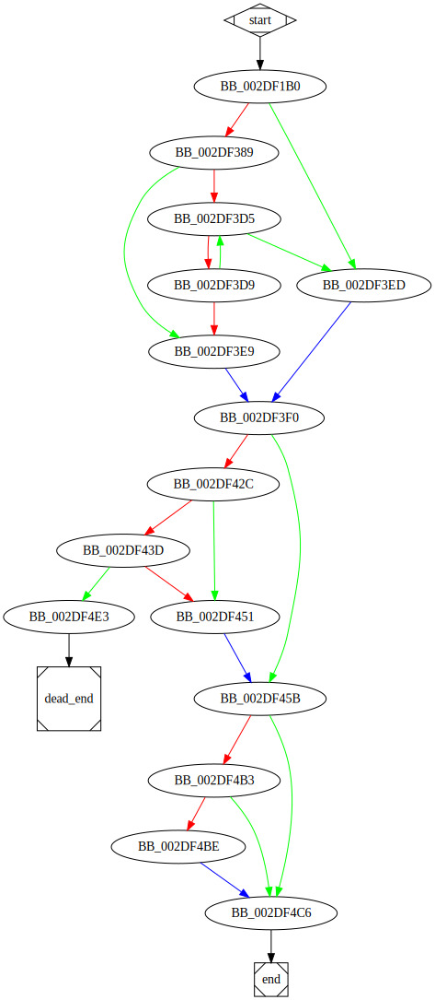

# sub_2DF1B0 function

## Tasks

- [ ] Add Description.
- [ ] Add Syntax.
- [X] Add Assembly.
- [ ] Add Source.
- [ ] Add Arguments.
- [ ] Add Return Value.
- [X] Add Dependencies.
- [X] Add Used By.
- [X] Add Graph.
- [ ] Add Flow.
- [ ] Add Pseudo-code.
- [ ] Fully documented (Including dependencies).

## Description

(Add description.)

## Syntax

(Add syntax.)

## Assembly

Go to [assembly](../asm/sub_2DF1B0.asm).

## Source

Go to [source](../cc/sub_2DF1B0.cc).

## Arguments

(Add arguments.)

## Return Value

(Add return value.)

## Dependencies

* Function dependencies:
  * [`sub_2D71D0`](sub_2D71D0.md) ✔️
  * [`GetModuleFileNameW`Docs](https://docs.microsoft.com/en-us/windows/win32/api/libloaderapi/nf-libloaderapi-getmodulefilenamew)
  * [`sub_2EB200`](sub_2EB200.md) ✔️
  * [`sub_2D3230`](sub_2D3230.md) ❓
  * [`sub_2E3BA0`](sub_2E3BA0.md) ✔️
  * [`sub_2E78B0`](sub_2E78B0.md) ✔️
  * [`sub_2E2C40`](sub_2E2C40.md) ✔️
  * [`_memset`](_memset.md) ⌛
  * [`sub_2EAF90`](sub_2EAF90.md) ❓
  * [`sub_2D6A50`](sub_2D6A50.md) ✔️
  * [`sub_30851F`](sub_30851F.md) ✔️
  * [`sub_2E2C40`](sub_2E2C40.md) ✔️
  * [`sub_2E2BC0`](sub_2E2BC0.md) ✔️
  * [`@__security_check_cookie@4`](@__security_check_cookie@4.md) ⌛
  * [`__invalid_parameter_noinfo_noreturn`](__invalid_parameter_noinfo_noreturn.md) ⌛

* Data dependencies:
  * [`dword_3571BC`](dword_3571BC.md) ⌛
  * [`dword_3571D0`](dword_3571D0.md) ⌛
  * [`dword_3571CC`](dword_3571CC.md) ⌛
  * [`xmmword_3571D4`](xmmword_3571D4.md) ⌛
  * [`qword_3571E4`](qword_3571E4.md) ⌛
  * [`byte_340C84`](byte_340C84.md) ⌛
  * `??_7?$wstring_convert@V?$codecvt_utf8_utf16@_W$0BAPPPP@$0A@@std@@_WV?$allocator@_W@2@V?$allocator@D@2@@std@@6B@`

## Used By

* Used by functions:
  * [`sub_2DF650`](sub_2DF650.md)

## Graph

## Flow

(Add flow.)

## Pseudo-code

(Add pseudo-code.)

