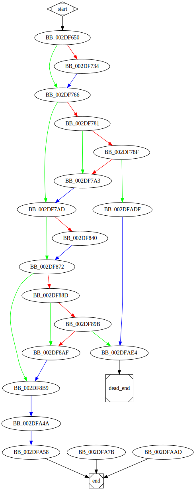

# sub_2DF650 function

## Tasks

- [ ] Add Description.
- [ ] Add Syntax.
- [X] Add Assembly.
- [X] Add Source.
- [ ] Add Arguments.
- [ ] Add Return Value.
- [X] Add Dependencies.
- [X] Add Used By.
- [X] Add Graph.
- [X] Add Flow.
- [X] Add Pseudo-code.
- [ ] Fully documented (Including dependencies).

## Description

(Add description.)

## Syntax

(Add syntax.)

## Assembly

Go to [assembly](../asm/sub_2DF650.asm).

## Source

Go to [source](../cc/sub_2DF650.cc).

## Arguments

(Add arguments.)

## Return Value

(Add return value.)

## Dependencies

* Function dependencies:
  * [`AllocateAndInitializeSid`<sup>Docs</sup>](https://docs.microsoft.com/en-us/windows/win32/api/securitybaseapi/nf-securitybaseapi-allocateandinitializesid)
  * [`GetCurrentProcessId`<sup>Docs</sup>](https://docs.microsoft.com/en-us/windows/win32/api/processthreadsapi/nf-processthreadsapi-getcurrentprocessid)
  * [`FreeConsole`<sup>Docs</sup>](https://docs.microsoft.com/en-us/windows/console/freeconsole)
  * [`sub_30DC04`](sub_30DC04.md) ✔️
  * [`sub_2F1320`](sub_2F1320.md) ⌛
  * [`sub_2E2BC0`](sub_2E2BC0.md) ⌛
  * [`sub_30851F`](sub_30851F.md) ⌛
  * [`sub_2E3350`](sub_2E3350.md) ⌛
  * [`sub_2F1320`](sub_2F1320.md) ⌛
  * [`sub_2F01C0`](sub_2F01C0.md) ⌛
  * [`sub_2F00A0`](sub_2F00A0.md) ⌛
  * [`sub_2D71D0`](sub_2D71D0.md) ⌛
  * [`sub_2DF1B0`](sub_2DF1B0.md) ⌛
  * [`sub_2DA3D0`](sub_2DA3D0.md) ⌛
  * [`sub_2E7840`](sub_2E7840.md) ⌛
  * [`sub_2DA440`](sub_2DA440.md) ⌛
  * [`sub_2E2C40`](sub_2E2C40.md) ⌛
  * [`sub_2DFCB0`](sub_2DFCB0.md) ❓
  * [`sub_2D6BD0`](sub_2D6BD0.md) ❓
  * [`sub_2E0280`](sub_2E0280.md) ✔️
  * [`sub_2DFB60`](sub_2DFB60.md) ❓
  * [`sub_2E0150`](sub_2E0150.md) ⌛
  * [`sub_2D9AF0`](sub_2D9AF0.md) ⌛
  * [`@__security_check_cookie@4`](@__security_check_cookie@4.md)
  * [`sub_2D26D0`](sub_2D26D0.md)
  * [`__invalid_parameter_noinfo_noreturn`](__invalid_parameter_noinfo_noreturn.md)

* Data dependencies
  * [`aCWindowsSysnat_0`](aCWindowsSysnat_0.md) ⌛
  * [`aCWindowsSystem_0`](aCWindowsSystem_0.md) ⌛
  * [`aUagkcg5mzsQxxu`](aUagkcg5mzsQxxu.md) ⌛
  * [`aErrrrrrrror`](aErrrrrrrror.md) ⌛

## Used By

* Used by functions:
  * [`StartAddress`](StartAddress.md)

## Graph



## Flow

```c
BB_002DF650:
//...
if (condition) {
  BB_002DF734:
  //...
}
BB_002DF766:
//...
if (condition) {
  BB_002DF781:
  //...
  if (condition) {
    BB_002DF78F:
    //...
    if (condition) {
      BB_002DFADF:
      //...
      goto BB_002DFAE4;
    }
  }

  BB_002DF7A3:
  //...
}
BB_002DF7AD:
//...
if (condition) {
  BB_002DF840:
  //...
}
BB_002DF872:
//...
if (condition) {
  BB_002DF88D:
  //...
  if (condition) {
    BB_002DF89B:
    //...
    if (condition) {
      goto BB_002DFAE4;
    }
  }

  BB_002DF8AF:
  //...
}
BB_002DF8B9:
//...
BB_002DFA4A:
//...
BB_002DFA58:
//...
return;

BB_002DFAE4:
//...
//dead_end

```

## Pseudo-code

### BB_002DF650

```c
pIdentifierAuthority.Value[0] = 0;
pIdentifierAuthority.Value[1] = 0;
pIdentifierAuthority.Value[2] = 0;
pIdentifierAuthority.Value[3] = 0;
pIdentifierAuthority.Value[4] = 0;
pIdentifierAuthority.Value[5] = 1;
v1 = &pIdentifierAuthority;
v2 = AllocateAndInitializeSid(v1, 1, 0, 0, 0, 0, 0, 0, 0, 0, pSid);
v3 = GetCurrentProcessId();
dword_359278 = v3;
v4 = FreeConsole();
v5 = sub_30DC04(aCWindowsSysnat_0);
v6 = sub_30DC04(aCWindowsSystem_0);
Block = 0;
var_24 = 0;
var_20 = 0;
var_24 = 0;
var_20 = 0xF;
Block = 0;
var_24 = 4;
Block = 0x42415141;
var_30 = 0;
var_4 = 0;
v7 = &Block;
v8 = &Src;
v9 = sub_2F1320(v8, v7, 0);
v10 = v9;
var_4 = 1;
if (v10 != &xmmword_35721C) {
  //BB_002DF734
  //...
}
//BB_002DF766:
//...
```

### BB_002DF734

```c
v11 = &xmmword_35721C;
v12 = sub_2E2BC0(v11); //UnknownObject.sub_2E2BC0(...)
v13 = v10->Xmm00;
xmmword_35721C = v13;
v14 = v10->Qword10;
qword_35722C = v14;
v10->Dword10 = 0;
v10->Dword14 = 0xF;
v10->Byte00 = 0;
//BB_002DF766
//...
```

### BB_002DF766

```c
var_4 = 0;
v15 = &Src;
v16 = sub_2E2BC0(v15); //UnknownObject.sub_2E2BC0(...)
var_4 = 0xFFFFFFFF;
v17 = var_20;
if (v17 >= 0x10) {
  //BB_002DF781
  //...
}
//BB_002DF7AD
//...
```

### BB_002DF781

```c
v18 = v17 + 1;
v19 = Block;
v20 = v19;
if (v18 >= 0x1000) {
  //BB_002DF78F
  //...
}
//BB_002DF7A3
//...
```

### BB_002DF78F

```c
v21 = v18 + 0x23;
v22 = v20->NegativeDword04;
v23 = v20 - v22;
v24 = v23 + 0xFFFFFFFC;
if (v24 <= 0x1F) {
  //BB_002DF7A3
  //...
}
//BB_002DFADF
//...
```

### BB_002DF7A3

```c
v25 = sub_30851F(v22, v21);
//BB_002DF7AD
//...
```

### BB_002DF7AD

```c
var_24 = 0;
var_20 = 0xF;
Block = 0;
Src = 0;
var_3C = 0;
var_38 = 0;
var_3C = 0;
var_38 = 0xF;
Src = 0;
v26 = &Src;
v27 = sub_2E3350(v26, 0x2B0); //UnknownObject.sub_2E3350(...)
var_3C = 0x2AC;
var_38 = 0x2AF;
v28 = 0xAB;
v29 = aUagkcg5mzsQxxu;
v30 = v27;
memcpy(v30, v29, v28);
v27->Byte2AC = 0;
Src = v27;
var_4 = 2;
v31 = &Src;
v32 = &Block;
v33 = sub_2F1320(v32, v31, 0);
v34 = v33;
var_4 = 3;
if (v34 != &xmmword_357204) {
  //BB_002DF840
  //...
}
//BB_002DF872
//...
```

### BB_002DF840

```c
v35 = &xmmword_357204;
v36 = sub_2E2BC0(v35);
v37 = v34->Xmm00;
xmmword_357204 = v37;
v38 = v34->Qword10;
qword_357214 = v38;
v34->Dword10 = 0;
v34->Dword14 = 0xF;
v34->Byte00 = 0;
//BB_002DF872
//...
```

### BB_002DF872

```c
var_4 = 2;
v39 = &Block;
v40 = sub_2E2BC0(v39);
var_4 = 0xFFFFFFFF;
v41 = var_38;
if (v41 >= 0x10) {
  //BB_002DF88D
  //...
}
//BB_002DF8B9
//...
```

### BB_002DF88D

```c
v42 = v41 + 1;
v43 = Src;
v44 = v43;
if (v42 >= 0x1000) {
  //BB_002DF89B
  //...
}
//BB_002DF8AF
//...
```

### BB_002DF89B

```c
v45 = v42 + 0x23;
v46 = v44->NegativeDword04;
v47 = v44 - v46;
v48 = v47 + 0xFFFFFFFC;
if (v48 <= 0x1F) {
  //BB_002DF8AF
  //...
}
//BB_002DFAE4
//...
```

### BB_002DF8AF

```c
v49 = sub_30851F(v46, v45);
//BB_002DF8B9
//...
```

### BB_002DF8B9

```c
var_3C = 0;
var_38 = 0xF;
Src = 0;
v50 = sub_2F01C0(unk_35925C);
v51 = &xmmword_35721C;
v52 = dword_357230 >= 0x10;
v53 = v52 ? dword_35721C: v51; //phi
v54 = sub_2F00A0(&unk_35925C, dword_35722C, 1, 1, 0, 0, v53);
v55 = sub_2F01C0(&unk_359250);
v56 = &xmmword_357204;
v57 = dword_357218 >= 0x10;
v58 = v57 ? dword_357204: v56; //phi
v59 = sub_2F00A0(&unk_359250, dword_357214, 1, 1, 0, 0, v58);
var_4 = 4;
v60 = &var_9C;
v61 = sub_2D71D0(v60); //UnknownObject.sub_2D71D0(...)
var_4 = 5;
v62 = &Block;
v63 = sub_2DF1B0(v62);
var_4 = 6;
v64 = &unk_3571EC;
v65 = sub_2DA3D0(v64, v63); //UnknownObject.sub_2DA3D0(...)
var_4 = 5;
v66 = &Block;
v67 = sub_2E2BC0(v66); //UnknownObject.sub_2E2BC0(...)
v68 = &Block;
v69 = &var_9C;
v70 = sub_2E7840(v69, v68); //UnknownObject.sub_2E7840(...)
var_4 = 7;
v71 = &unk_357264;
v72 = sub_2DA440(v71, v68); //UnknownObject.sub_2DA440(...)
var_4 = 5;
v73 = &Block;
v74 = sub_2E2C40(v73); //UnknownObject.sub_2E2C40(...)
v75 = &Block;
v76 = sub_2DFCB0(v75);
var_4 = 8;
v77 = &unk_357294;
v78 = sub_2DA440(v77, v76); //UnknownObject.sub_2DA440(...)
var_4 = 5;
v79 = &Block;
v80 = sub_2E2C40(v79); //UnknownObject.sub_2E2C40(...)
v81 = _alloca(0x18);
v82 = v81;
var_A0 = v81;
v83 = sub_2D6BD0(unk_357294);
var_4 = 9;
var_4 = 5;
v84 = sub_2E0280();
v85 = &Block;
v86 = sub_2DFB60(v85);
var_4 = 0xA;
v87 = &unk_3572AC;
v88 = sub_2DA440(v87, v86); //UnknownObject.sub_2DA440(...)
var_4 = 5;
v89 = &Block;
v90 = sub_2E2C40(v89); //UnknownObject.sub_2E2C40(...)
v91 = _alloca(0x18);
v92 = v91;
var_A0 = v91;
v93 = sub_2D6BD0(unk_3572AC);
var_4 = 0xB;
var_4 = 5;
v94 = sub_2E0150();
var_4 = 4;
v95 = &var_9C;
v96 = sub_2D9AF0(v95);
//BB_002DFA4A
//...
```

### BB_002DFA4A

```c
var_4 = 0xFFFFFFFF;
var_4 = 0xD;
//BB_002DFA58
//...
```

### BB_002DFA58

```c
var_4 = 0xFFFFFFFF;
return v96;
//end
```

### BB_002DFA7B

```c
v97 = var_A4;
v98 = v97->Dword00;
v99 = v98->Dword04;
v100 = v99();
v101 = v100;
v102 = sub_2D26D0(unk_359670, aErrrrrrrror);
v103 = sub_2D26D0(unk_359670, v101);
v104 = &loc_2DFA4A;
return v104;
//end
```

### BB_002DFAAD

```c
v105 = var_A8;
v106 = v105->Dword00;
v107 = v106->Dword04;
v108 = v107();
v109 = v108;
v110 = sub_2D26D0(unk_359670, aErrrrrrrror);
v111 = sub_2D26D0(unk_359670, v109);
v112 = &loc_2DFA58;
return v112;
//end
```

### BB_002DFADF

```c
v113 = __invalid_parameter_noinfo_noreturn();
//BB_002DFAE4
//...
```

### BB_002DFAE4

```c
v114 = __invalid_parameter_noinfo_noreturn();
//dead_end
```
