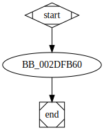

# sub_2DFB60 function

## Tasks

- [ ] Add Description.
- [ ] Add Syntax.
- [X] Add Assembly.
- [ ] Add Source.
- [ ] Add Arguments.
- [ ] Add Return Value.
- [X] Add Dependencies.
- [X] Add Used By.
- [X] Add Graph.
- [ ] Add Flow.
- [ ] Add Pseudo-code.
- [ ] Fully documented (Including dependencies).

## Description

(Add description.)

## Syntax

(Add syntax.)

## Assembly

Go to [assembly](../asm/sub_2DFB60.asm).

## Source

Go to [source](../cc/sub_2DFB60.cc).

## Arguments

(Add arguments.)

## Return Value

(Add return value.)

## Dependencies

* Function dependencies:
  * [`sub_2ECD20`](sub_2ECD20.md) ❓
  * [`sub_2D6BD0`](sub_2D6BD0.md) ❓
  * [`sub_2D2DC0`](sub_2D2DC0.md) ❓
  * [`sub_2E2C40`](sub_2E2C40.md) ✔️
  * [`sub_2D67A0`](sub_2D67A0.md) ✔️
  * [`sub_2EBF50`](sub_2EBF50.md) ❓
  * [`sub_2ED3E0`](sub_2ED3E0.md) ❓
  * [`sub_2E76E0`](sub_2E76E0.md) ⌛
  * [`sub_2E4190`](sub_2E4190.md) ⌛
  * [`sub_2DB720`](sub_2DB720.md) ⌛
  * [`@__security_check_cookie@4`](@__security_check_cookie@4.md) ⌛

* Data dependencies:
  * [`aFkdjsadasdIco`](aFkdjsadasdIco.md) ⌛
  * [`dword_357194`](dword_357194.md) ⌛
  * [`unk_33C628`](unk_33C628.md) ⌛

## Used By

* Used by functions:
  * [`sub_2DF650`](sub_2DF650.md)

## Graph

## Flow

(Add flow.)

## Pseudo-code

(Add pseudo-code.)

