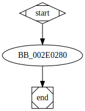

# sub_2E0280 function

## Tasks

- [ ] Add Description.
- [ ] Add Syntax.
- [X] Add Assembly.
- [ ] Add Source.
- [ ] Add Arguments.
- [ ] Add Return Value.
- [X] Add Dependencies.
- [X] Add Used By.
- [X] Add Graph.
- [ ] Add Flow.
- [ ] Add Pseudo-code.
- [ ] Fully documented (Including dependencies).

## Description

(Add description.)

## Syntax

(Add syntax.)

## Assembly

Go to [assembly](../asm/sub_2E0280.asm).

## Source

Go to [source](../cc/sub_2E0280.cc).

## Arguments

(Add arguments.)

## Return Value

(Add return value.)

## Dependencies

* Function dependencies:
  * [`SystemParametersInfoW`Docs](https://docs.microsoft.com/en-us/windows/win32/api/winuser/nf-winuser-systemparametersinfow)
  * [`sub_2E2C40`](sub_2E2C40.md)

* Data dependencies:
  * None.

## Used By

* Used by functions:
  * [`sub_2DF650`](sub_2DF650.md)

## Graph

## Flow

(Add flow.)

## Pseudo-code

(Add pseudo-code.)

