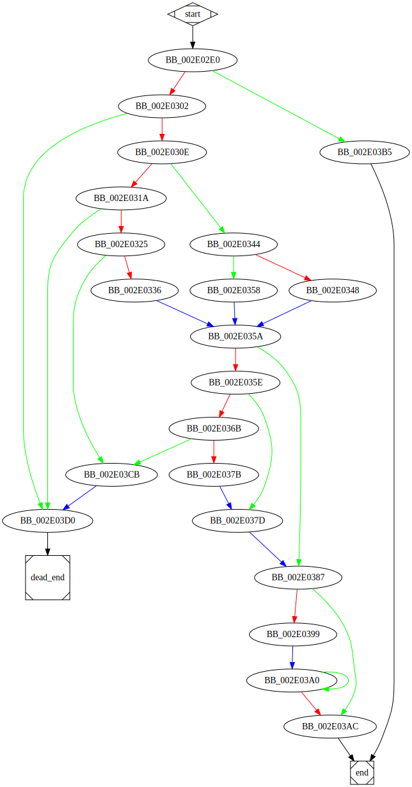

# sub_2E02E0 function

## Description

This function is a method of an unknown class. It performs the following actions:
* It performs a check as follows:
```c
  //BB_002E02E0
  //...
  bool condition1 = ((Object->a - Object->b) >> 2) >= arg_0;
  if (condition1) {
    //...
  }
```

* It performs a check as follows:
```c
  //BB_002E0302
  bool condition2 = arg_0 <= 0x3FFFFFFF;
  if (condition2) {
    //...
  }
```

## Arguments

* `Object` : The object of the unknown class (Referenced through `ecx` register).
* `arg_0` : First Argument


## Return Value

(Add return value.)

## Dependencies

* Function dependencies:
  * [`??2@YAPAXI@Z`](%3F%3F2%40YAPAXI%40Z.md)
  * [`sub_30851F`](sub_30851F.md)
  * [`sub_2D4A00`](sub_2D4A00.md)
  * [`__invalid_parameter_noinfo_noreturn`](__invalid_parameter_noinfo_noreturn.md)
  * [`sub_2E29D0`](sub_2E29D0.md)

## Graph



## Remarks

### Object Structure

The `Object` is defined as follows:

```c
struct {
 int a;
 int b;
};
```

