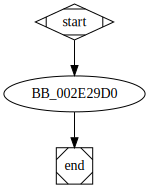

# sub_2E29D0 function

## Description


## Syntax

```c

```

## Arguments


## Return Value

(Add return value.)

## Dependencies

* Function dependencies:
  * [`sub_2D7A00`](sub_2D7A00.md)
  * [`sub_3098A0`](sub_3098A0.md)

* Data dependencies:
  * `__TI3?AVbad_array_new_length@std@@`

## Used By

* Used by functions:
  * [`sub_2E3350`](sub_2E3350.md)

## Graph



