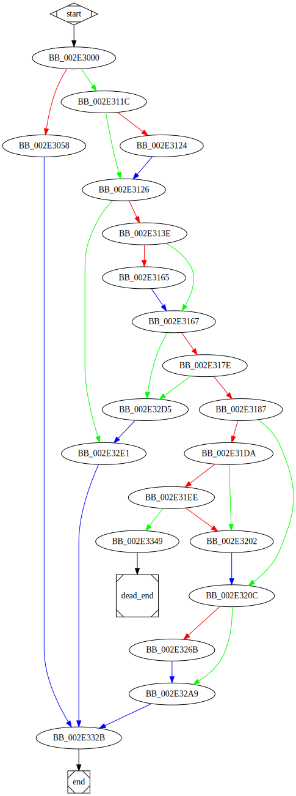

# sub_2E3000 function

## Tasks

- [ ] Add Description.
- [ ] Add Syntax.
- [X] Add Assembly.
- [ ] Add Source.
- [ ] Add Arguments.
- [ ] Add Return Value.
- [X] Add Dependencies.
- [X] Add Used By.
- [X] Add Graph.
- [ ] Add Flow.
- [ ] Add Pseudo-code.
- [ ] Fully documented (Including dependencies).

## Description

(Add description.)

## Syntax

(Add syntax.)

## Assembly

Go to [assembly](../asm/sub_2E3000.asm).

## Source

Go to [source](../cc/sub_2E3000.cc).

## Arguments

(Add arguments.)

## Return Value

(Add return value.)

## Dependencies

* Function dependencies:
  * [`sub_2D58D0`](sub_2D58D0.md) ❓
  * [`sub_2EA1C0`](sub_2EA1C0.md) ✅
  * [`sub_2E4650`](sub_2E4650.md) ✅
  * `sub_2E3000` *(Recursive)*
  * [`sub_2D6BD0`](sub_2D6BD0.md) ⌛
  * [`sub_2DB0D0`](sub_2DB0D0.md) ⌛
  * [`sub_2E2C40`](sub_2E2C40.md) ⌛
  * [`GetFullPathNameW`Docs](https://docs.microsoft.com/en-us/windows/win32/api/fileapi/nf-fileapi-getfullpathnamew)
  * [`sub_2D70F0`](sub_2D70F0.md) ⌛
  * [`sub_2E3C90`](sub_2E3C90.md) ⌛
  * [`sub_2D8A90`](sub_2D8A90.md) ⌛
  * [`sub_30851F`](sub_30851F.md) ⌛
  * [`sub_2D23A0`](sub_2D23A0.md) ⌛
  * [`sub_2E7230`](sub_2E7230.md) ⌛
  * [`sub_2E4220`](sub_2E4220.md) ⌛
  * [`sub_2D8A00`](sub_2D8A00.md) ⌛
  * [`sub_2E2B30`](sub_2E2B30.md) ⌛
  * [`GetLastError`Docs](https://docs.microsoft.com/en-us/windows/win32/api/errhandlingapi/nf-errhandlingapi-getlasterror)
  * [`@__security_check_cookie@4`](@__security_check_cookie@4.md) ⌛
  * [`__invalid_parameter_noinfo_noreturn`](__invalid_parameter_noinfo_noreturn.md) ⌛

* Data dependencies:
  * [`off_357548`](off_357548.md) ⌛
  * [`byte_340C84`](byte_340C84.md) ⌛
  * [`asc_340F54`](asc_340F54.md) ⌛

## Used By

* Used by functions:
  * [`sub_2E2F10`](sub_2E2F10.md)

## Graph

## Flow

(Add flow.)

## Pseudo-code

(Add pseudo-code.)
