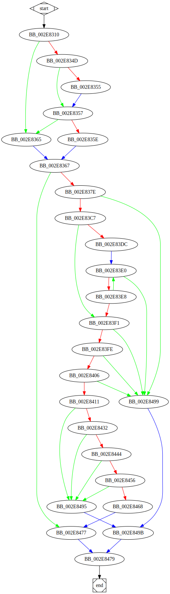

# sub_2E8310 function

## Tasks

- [ ] Add Description.
- [ ] Add Syntax.
- [X] Add Assembly.
- [ ] Add Source.
- [ ] Add Arguments.
- [ ] Add Return Value.
- [X] Add Dependencies.
- [X] Add Used By.
- [X] Add Graph.
- [ ] Add Flow.
- [ ] Add Pseudo-code.
- [ ] Fully documented (Including dependencies).

## Description

(Add description.)

## Syntax

(Add syntax.)

## Assembly

Go to [assembly](../asm/sub_2E8310.asm).

## Source

Go to [source](../cc/sub_2E8310.cc).

## Arguments

(Add arguments.)

## Return Value

(Add return value.)

## Dependencies

* Function dependencies:
  * [`sub_2EB8D0`](sub_2EB8D0.md) ✅
  * [`sub_2E6F80`](sub_2E6F80.md) ❓
  * [`sub_2E48F0`](sub_2E48F0.md) ❓
  * [`sub_2ED290`](sub_2ED290.md) ❓
  * [`__wcsicmp`](__wcsicmp.md) ⌛
  * [`sub_2DA1A0`](sub_2DA1A0.md) ⌛
  * [`@__security_check_cookie@4`](@__security_check_cookie@4.md) ⌛
  * [`sub_2E2C40`](sub_2E2C40.md) ⌛

* Data dependencies:
  * [`aExe`](aExe.md) ⌛
  * [`aCmd`](aCmd.md) ⌛
  * [`aBat`](aBat.md) ⌛
  * [`aCom`](aCom.md) ⌛

## Used By

* Used by functions:
  * [`sub_2D5180`](sub_2D5180.md)

## Graph

## Flow

(Add flow.)

## Pseudo-code

(Add pseudo-code.)
