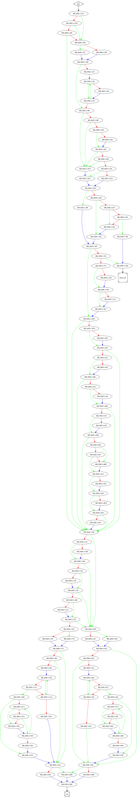

# sub_2EA1C0 function

## Tasks

- [ ] Add Description.
- [ ] Add Syntax.
- [X] Add Assembly.
- [ ] Add Source.
- [ ] Add Arguments.
- [ ] Add Return Value.
- [X] Add Dependencies.
- [X] Add Used By.
- [X] Add Graph.
- [ ] Add Flow.
- [ ] Add Pseudo-code.
- [ ] Fully documented (Including dependencies).

## Description

(Add description.)

## Syntax

(Add syntax.)

## Assembly

Go to [assembly](../asm/sub_2EA1C0.asm).

## Source

Go to [source](../cc/sub_2EA1C0.cc).

## Arguments

(Add arguments.)

## Return Value

(Add return value.)

## Dependencies

* Function dependencies:
  * [`sub_2EB8D0`](sub_2EB8D0.md) ✔️
  * [`sub_2E3C90`](sub_2E3C90.md) ✔️
  * [`sub_2D5100`](sub_2D5100.md) ❓
  * [`sub_30851F`](sub_30851F.md) ✔️
  * [`sub_2D6F70`](sub_2D6F70.md) ❓
  * [`sub_2E2C40`](sub_2E2C40.md) ✔️
  * [`_toupper`](_toupper.md) ⌛
  * [`sub_2D6D40`](sub_2D6D40.md) ❓
  * [`_memmove`](_memmove.md) ⌛
  * [`@__security_check_cookie@4`](@__security_check_cookie@4.md) ⌛
  * [`__invalid_parameter_noinfo_noreturn`](__invalid_parameter_noinfo_noreturn.md) ⌛
  * [`sub_2E2ED0`](sub_2E2ED0.md) ⌛

* Data dependencies:
  * [`asc_340F38`](asc_340F38.md) ✔️
  * [`asc_340F44`](asc_340F44.md) ⌛

## Used By

* Used by functions:
  * [`sub_2D8A90`](sub_2D8A90.md)

## Graph

## Flow

(Add flow.)

## Pseudo-code

(Add pseudo-code.)

