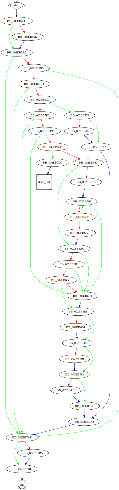

# sub_2EB4D0 function

## Tasks

- [ ] Add Description.
- [ ] Add Syntax.
- [X] Add Assembly.
- [ ] Add Source.
- [ ] Add Arguments.
- [ ] Add Return Value.
- [X] Add Dependencies.
- [X] Add Used By.
- [X] Add Graph.
- [ ] Add Flow.
- [ ] Add Pseudo-code.
- [ ] Fully documented (Including dependencies).

## Description

(Add description.)

## Syntax

(Add syntax.)

## Assembly

Go to [assembly](../asm/sub_2EB4D0.asm).

## Source

Go to [source](../cc/sub_2EB4D0.cc).

## Arguments

(Add arguments.)

## Return Value

(Add return value.)

## Dependencies

* Function dependencies:
  * [`sub_2E8100`](sub_2E8100.md) ✅
  * [`_free`](_free.md) ⌛
  * [`sub_2D6D90`](sub_2D6D90.md) ⌛
  * [`sub_2D6D40`](sub_2D6D40.md) ⌛
  * [`sub_2D5100`](sub_2D5100.md) ⌛
  * [`sub_2E2C40`](sub_2E2C40.md) ⌛
  * [`sub_2D4730`](sub_2D4730.md) ⌛
  * [`sub_2E9D30`](sub_2E9D30.md) ⌛
  * [`sub_2DB050`](sub_2DB050.md) ⌛
  * [`sub_2DA4B0`](sub_2DA4B0.md) ⌛
  * [`sub_2E7F40`](sub_2E7F40.md) ⌛
  * [`@__security_check_cookie@4`](@__security_check_cookie@4.md) ⌛
  * [`sub_2E2EF0`](sub_2E2EF0.md) ⌛

* Data dependencies:
  * [`asc_340F44`](asc_340F44.md) ⌛

## Used By

* Used by functions:
  * [`sub_2EC5E0`](sub_2EC5E0.md)

## Graph

## Flow

(Add flow.)

## Pseudo-code

(Add pseudo-code.)
