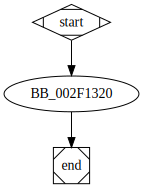

# sub_2F1320 function

## Description

## Arguments

(Add arguments.)

## Return Value

(Add return value.)

## Dependencies

* Function dependencies:
  * [`sub_2D6A50`](sub_2D6A50.md)
  * [`sub_2F0BD0`](sub_2F0BD0.md)

## Used By

* Used by functions:
  * [`sub_2DF650`](sub_2DF650.md)

## Graph

