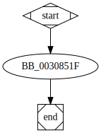

# sub_30851F function

## Tasks

- [ ] Add Description.
- [ ] Add Syntax.
- [ ] Add Assembly.
- [ ] Add Source.
- [ ] Add Arguments.
- [ ] Add Return Value.
- [ ] Add Dependencies.
- [ ] Add Used By.
- [ ] Add Graph.
- [ ] Add Flow.
- [ ] Add Pseudo-code.
- [ ] Fully documented (Including dependencies).

## Description

This function frees a previously allocated buffer through the use of the function [`j__free`](j__free.md).
## Arguments

* `Block` : A pointer to the memory buffer that will be freed.

## Return Value

None.

## Dependencies

* Function dependencies:
  * [`j__free`](j__free.md)

## Graph

