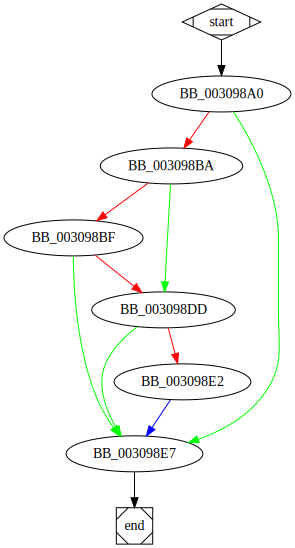

# sub_3098A0 function

## Description

This function raises an exception by using the Windows API [`RaiseException`<sup>Docs</sup>](https://docs.microsoft.com/en-us/windows/win32/api/errhandlingapi/nf-errhandlingapi-raiseexception).

## Syntax

```c

```

## Arguments


## Return Value

(Add return value.)

## Dependencies

* Function dependencies:
  * [`___guard_check_icall_fptr`](___guard_check_icall_fptr.md)
  * [`RaiseException`<sup>Docs</sup>](https://docs.microsoft.com/en-us/windows/win32/api/errhandlingapi/nf-errhandlingapi-raiseexception)

* Data dependencies:
  * None.

## Used By

* Used by functions:
  * [`sub_2E29D0`](sub_2E29D0.md)

## Graph



