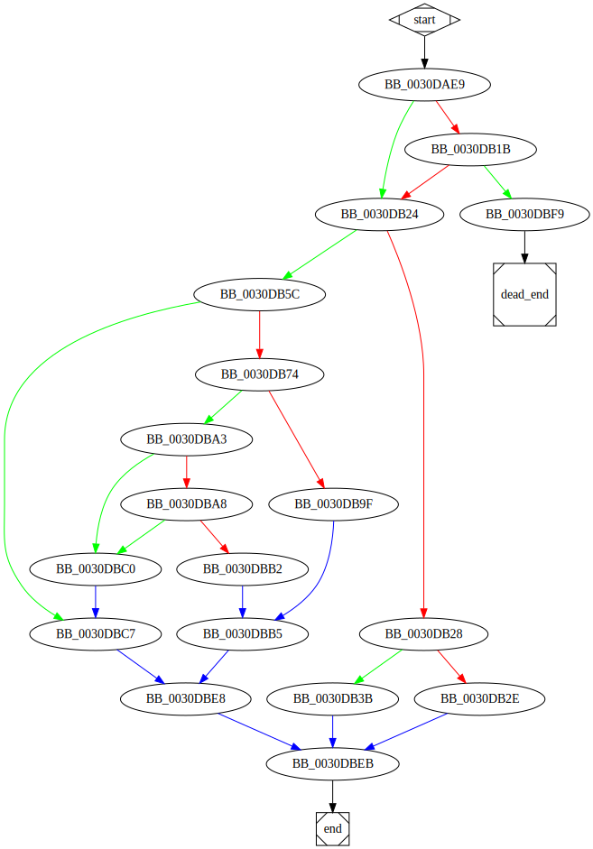

# sub_30DAE9 function

## Description

## Arguments

## Return Value

(Add return value.)

## Dependencies

* Function dependencies:
  * [`__dupenv_s`](__dupenv_s.md)
  * [`__free_base`](__free_base.md)
  * [`__access_s`](__access_s.md)
  * [`__errno`](__errno.md)
  * [`__spawnve`](__spawnve.md)
  * [`__spawnvpe`](__spawnvpe.md)
  * [`@__security_check_cookie@4`](@__security_check_cookie@4.md)
  * [`__invoke_watson`](__invoke_watson.md)

* Data dependencies:
  * [`VarName`](VarName.md)
  * [`aC`](aC.md)
  * [`aCmdExe_0`](aCmdExe_0.md)
  

## Graph

