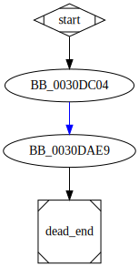

# sub_30DC04 function

## Description

This function jumps to the function [`sub_30DAE9`](sub_30DAE9.md).

## Syntax

```c
DWORD sub_30DC04(CHAR* CommandLine)
{...}
```

## Arguments

* `CommandLine` : The command line that will be executed

## Return Value

(Add return value.)

## Dependencies

* Function dependencies:
  * [`sub_30DAE9`](sub_30DAE9.md)

## Used By

* Used by functions:
  * [`sub_2DF650`](sub_2DF650.md)

## Graph



