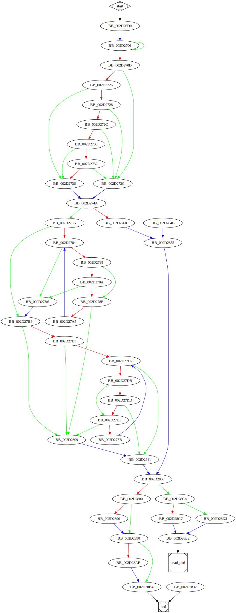

# sub_2D26D0 function

## Tasks

- [ ] Add Description.
- [ ] Add Syntax.
- [X] Add Assembly.
- [ ] Add Source.
- [ ] Add Arguments.
- [ ] Add Return Value.
- [X] Add Dependencies.
- [X] Add Used By.
- [X] Add Graph.
- [ ] Add Flow.
- [ ] Add Pseudo-code.
- [ ] Fully documented (Including dependencies).

## Description

(Add description.)

## Syntax

(Add syntax.)

## Assembly

Go to [assembly](../asm/sub_2D26D0.asm).

## Source

Go to [source](../cc/sub_2D26D0.cc).

## Arguments

(Add arguments.)

## Return Value

(Add return value.)

## Dependencies

* Function dependencies:
  * [`sub_2D8D10`](sub_2D8D10.md) ❓
  * [`sub_2EC490`](sub_2EC490.md) ❓
  * [`sub_2EC3C0`](sub_2EC3C0.md) ❓
  * [`j____uncaught_exception`](j____uncaught_exception.md) ⌛
  * [`sub_2E2720`](sub_2E2720.md) ❓
  * `?make_error_code@std@@YA?AVerror_code@1@W4io_errc@1@@Z_0`
  * [`sub_2D7ED0`](sub_2D7ED0.md) ❓
  * [`sub_3098A0`](sub_3098A0.md) ✅

* Data dependencies:
  * [`aIosBaseBadbitS`](aIosBaseBadbitS.md) ⌛
  * [`aIosBaseFailbit`](aIosBaseFailbit.md) ⌛
  * [`aIosBaseEofbitS`](aIosBaseEofbitS.md) ⌛
  * `__TI5?AVfailure@ios_base@std@@`

## Used By

* Used by functions:
  * [`sub_2DC5A0`](sub_2DC5A0.md)
  * [`sub_2DFE80`](sub_2DFE80.md)

## Graph



## Pseudo-code

(Add pseudo-code.)

## Flow

```c
BB_002D26D0:
//...

BB_002D2706:
do{
  //...
}while (condition);

BB_002D270D:
//...
if (condition) {
  BB_002D2726:
  //...
  if (condition) {
    BB_002D2728:
    //...
    if (condition) {
      BB_002D272C:
      //...
      if (condition)
      {
        BB_002D2730:
        //...
        if (condition) {
          BB_002D2732:
          //...
          if (condition)
          {
            goto BB_002D2736;
          }
        } else {
          goto BB_002D2736;
        }
      }
    }
  } else {
    goto BB_002D2736;
  }
}
BB_002D273C:
//...

goto BB_002D274A;
BB_002D2736:
//...

BB_002D274A:
//...
if (condition) {
  BB_002D2760:
  //...

  BB_002D2855:
  //...
} else {
  BB_002D276A:
  //...


}
BB_002D2858:
//...


```