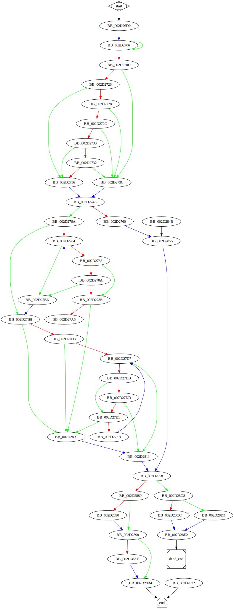

# sub_4026D0 function

## Tasks

- [ ] Add Description.
- [ ] Add Syntax.
- [X] Add Assembly.
- [ ] Add Source.
- [ ] Add Arguments.
- [ ] Add Return Value.
- [X] Add Dependencies.
- [X] Add Used By.
- [X] Add Graph.
- [ ] Add Flow.
- [ ] Add Pseudo-code.
- [ ] Fully documented (Including dependencies).

## Description

(Add description.)

## Syntax

(Add syntax.)

## Assembly

Go to [assembly](../asm/sub_4026D0.asm).

## Source

Go to [source](../cc/sub_4026D0.cc).

## Arguments

(Add arguments.)

## Return Value

(Add return value.)

## Dependencies

* Function dependencies:
  * [`sub_408D10`](sub_408D10.md) ❓
  * [`sub_41C490`](sub_41C490.md) ❓
  * [`sub_41C3C0`](sub_41C3C0.md) ❓
  * [`j____uncaught_exception`](j____uncaught_exception.md) ⌛
  * [`sub_412720`](sub_412720.md) ❓
  * `?make_error_code@std@@YA?AVerror_code@1@W4io_errc@1@@Z_0`
  * [`sub_407ED0`](sub_407ED0.md) ❓
  * [`sub_4398A0`](sub_4398A0.md) ✅

* Data dependencies:
  * [`aIosBaseBadbitS`](aIosBaseBadbitS.md) ⌛
  * [`aIosBaseFailbit`](aIosBaseFailbit.md) ⌛
  * [`aIosBaseEofbitS`](aIosBaseEofbitS.md) ⌛
  * `__TI5?AVfailure@ios_base@std@@`

## Used By

* Used by functions:
  * [`sub_40C5A0`](sub_40C5A0.md)
  * [`sub_40FE80`](sub_40FE80.md)

## Graph



## Pseudo-code

(Add pseudo-code.)

## Flow

```c
BB_004026D0:
//...

BB_00402706:
do{
  //...
}while (condition);

BB_0040270D:
//...
if (condition) {
  BB_00402726:
  //...
  if (condition) {
    BB_00402728:
    //...
    if (condition) {
      BB_0040272C:
      //...
      if (condition)
      {
        BB_00402730:
        //...
        if (condition) {
          BB_00402732:
          //...
          if (condition)
          {
            goto BB_00402736;
          }
        } else {
          goto BB_00402736;
        }
      }
    }
  } else {
    goto BB_00402736;
  }
}
BB_0040273C:
//...

goto BB_0040274A;
BB_00402736:
//...

BB_0040274A:
//...
if (condition) {
  BB_00402760:
  //...

  BB_00402855:
  //...
} else {
  BB_0040276A:
  //...


}
BB_00402858:
//...


```