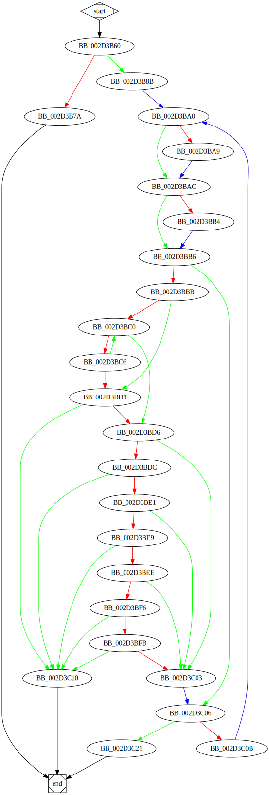

# sub_403B60 function

## Tasks

- [ ] Add Description.
- [ ] Add Syntax.
- [ ] Add Assembly.
- [ ] Add Source.
- [ ] Add Arguments.
- [ ] Add Return Value.
- [ ] Add Dependencies.
- [ ] Add Used By.
- [ ] Add Graph.
- [ ] Add Flow.
- [ ] Add Pseudo-code.
- [ ] Fully documented (Including dependencies).

## Description

This function is a method of an unknown object.

## Arguments

* `Object` : An object of an unknown class.

## Return Value

(Add return value.)

## Dependencies

* Function dependencies:
  * None.

## Graph



## Pseudo-code

### BB_00403B60

```c
v1 = Object->Dword18;
v2 = v1 & arg_8;
v3 = Object->Dword0C;
v4 = Object->Dword04;
v5 = v3 + v2*8;
v6 = v5->Dword04;
if (v6 == v4) {
  //BB_00403B7A
  //...
}
//BB_00403B8B
//...
```

### BB_00403B7A

```c
v7 = arg_0;
v7->Dword00 = v4;
v7->Dword04 = 0;
return;
```

### BB_00403B8B

```c
v8 = v5->Dword00;
v9 = arg_4;
arg_8 = v8;
v10 = v9->Dword10;
//BB_00403BA0
//...
```

### BB_00403BA0

```c
v11 = v6->Dword1C >= 0x10;
v12 = &v6->Dword08;
if (v11) {
  //BB_00403BA9
  //...
}
//BB_00403BAC
//...
```

### BB_00403BA9

```c
v13 = v6->Dword08;
//BB_00403BAC
//...
```

### BB_00403BAC

```c
v14 = v11 ? v13: v12; //v14 = phi(v12, v13) : This variable depends on the branch that was taken.
v15 = v9->Dword14 >= 0x10;
v16 = v9;
if (v15) {
  //BB_00403BB4
  //...
}
//BB_00403BB6
//...
```

### BB_00403BB4

```c
v17 = v9->Dword00;
//BB_00403BB6
//...
```

### BB_00403BB6

```c
v18 = v15 ? v17: v16; //v18 = phi(v16, v17) 
if (v10 == v6->Dword18) {
  //BB_00403BBB
  //...
}
//BB_00403C06
//...
```

### BB_00403BBB

```c
v19 = v10 - 4;
if (v19 >= 0) //Unsure about correctness: this needs manual verification.
{
  //BB_00403BC0
  //...
}
//BB_00403BD1
//...
```

### BB_00403BC0

```c
v20 = v18->Dword00;
if (v20 == v14->Dword00) {
  //BB_00403BC6
  //...
}
//BB_00403BD6
//...
```

### BB_00403BC6

```c
v21 = v18 + 4;
v22 = v14 + 4;
 v18 = v21; //Propagate changes to BB_00403BC0
 v14 = v22; //Propagate changes to BB_00403BC0
v23 = v19 - 4;
if (v23 < 0) //Unsure about correctness: this needs manual verification.
{
  //BB_00403BD1
  //...
}
//BB_00403BC0
//...
```

### BB_00403BD1

```c
if (v23 != 0xFFFFFFFC) {
  //BB_00403BD6
  //...
}
//BB_00403C10
//...
```

### BB_00403BD6

```c
v24 = v18->Byte00;
if (v24 == v14->Byte00) {
  //BB_00403BDC
  //...
}
//BB_00403C03
//...
```

### BB_00403BDC

```c
if (v23 != 0xFFFFFFFD) {
  //BB_00403BE1
  //...
}
//BB_00403C10
//...
```


