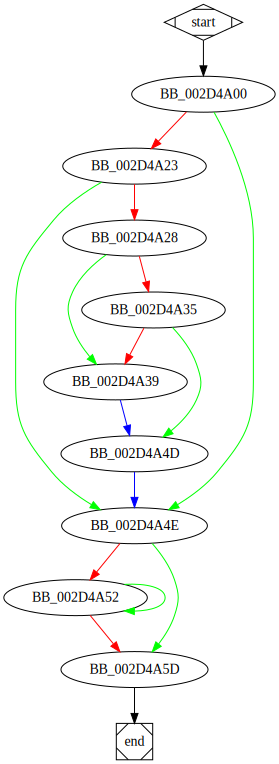

# sub_404A00 function

## Tasks

- [ ] Add Description.
- [ ] Add Syntax.
- [ ] Add Assembly.
- [ ] Add Source.
- [ ] Add Arguments.
- [ ] Add Return Value.
- [ ] Add Dependencies.
- [ ] Add Used By.
- [ ] Add Graph.
- [ ] Add Flow.
- [ ] Add Pseudo-code.
- [ ] Fully documented (Including dependencies).

## Description

This function performs several checks.

## Arguments

* `arg_0` : 
* `arg_4` : 
* `arg_8` : 

## Return Value

(Add return value.)

## Dependencies

* Function dependencies:
  * None.

## Graph

