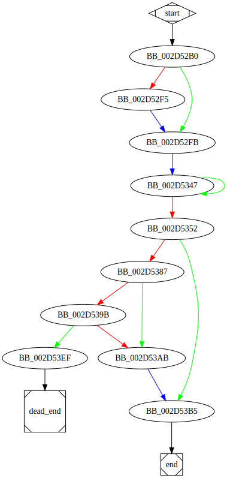

# sub_4052B0 function

## Tasks

- [ ] Add Description.
- [ ] Add Syntax.
- [X] Add Assembly.
- [ ] Add Source.
- [ ] Add Arguments.
- [ ] Add Return Value.
- [X] Add Dependencies.
- [X] Add Used By.
- [X] Add Graph.
- [ ] Add Flow.
- [ ] Add Pseudo-code.
- [ ] Fully documented (Including dependencies).

## Description

(Add description.)

## Syntax

(Add syntax.)

## Assembly

Go to [assembly](../asm/sub_4052B0.asm).

## Source

Go to [source](../cc/sub_4052B0.cc).

## Arguments

(Add arguments.)

## Return Value

(Add return value.)

## Dependencies

* Function dependencies:
  * [`GetLastError`Docs](https://docs.microsoft.com/en-us/windows/win32/api/errhandlingapi/nf-errhandlingapi-getlasterror)
  * [`FormatMessageW`Docs](https://docs.microsoft.com/en-us/windows/win32/api/winbase/nf-winbase-formatmessagew)
  * [`sub_413C90`](sub_413C90.md)
  * [`sub_405400`](sub_405400.md)
  * [`sub_30851F`](sub_30851F.md)
  * [`__imp_LocalFree`Docs](https://docs.microsoft.com/en-us/windows/win32/api/winbase/nf-winbase-localfree)
  * [`@__security_check_cookie@4`](@__security_check_cookie@4.md)
  * [`__invalid_parameter_noinfo_noreturn`](__invalid_parameter_noinfo_noreturn.md)

* Data dependencies:
  * None.

## Used By

* Used by functions:
  * [`sub_41CD20`](sub_41CD20.md)

## Graph

## Flow

(Add flow.)

## Pseudo-code

(Add pseudo-code.)

