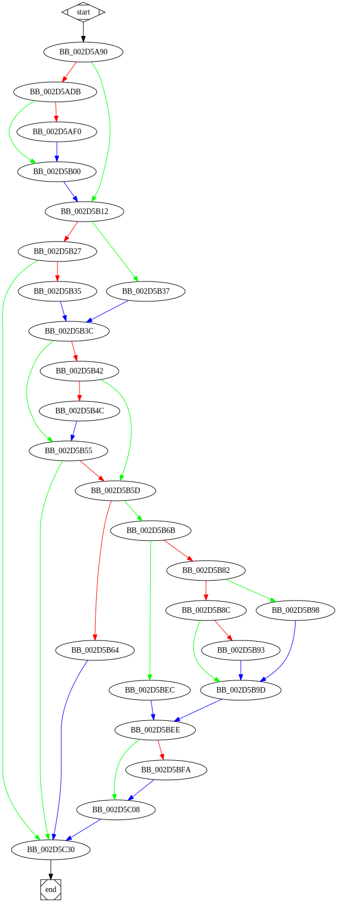

# sub_405A90 function

## Tasks

- [ ] Add Description.
- [ ] Add Syntax.
- [X] Add Assembly.
- [ ] Add Source.
- [ ] Add Arguments.
- [ ] Add Return Value.
- [X] Add Dependencies.
- [X] Add Used By.
- [X] Add Graph.
- [ ] Add Flow.
- [ ] Add Pseudo-code.
- [ ] Fully documented (Including dependencies).

## Description

(Add description.)

## Syntax

(Add syntax.)

## Assembly

Go to [assembly](../asm/sub_405A90.asm).

## Source

Go to [source](../cc/sub_405A90.cc).

## Arguments

(Add arguments.)

## Return Value

(Add return value.)

## Dependencies

* Function dependencies:
  * `??0_Lockit@std@@QAE@H@Z`
  * `??1_Lockit@std@@QAE@XZ`
  * [`sub_421F12`](sub_421F12.md) ❓
  * `??2@YAPAXI@Z`
  * [`sub_4075D0`](sub_4075D0.md) ❓
  * [`sub_409BF0`](sub_409BF0.md) ❓
  * `?_Facet_Register@std@@YAXPAV_Facet_base@1@@Z`

* Data dependencies:
  * [`dword_489350`](dword_489350.md) ❓
  * [`dword_489370`](dword_489370.md) ❓
  * [`dword_4895F0`](dword_4895F0.md) ❓
  * [`byte_470C84`](byte_470C84.md) ❓
  * `??_7_Facet_base@std@@6B@`
  * `??_7facet@locale@std@@6B@`
  * `??_7codecvt_base@std@@6B@`
  * `??_7?$codecvt@DDU_Mbstatet@@@std@@6B@`

## Used By

* Used by functions:
  * [`sub_419970`](sub_419970.md)

## Graph

## Flow

(Add flow.)

## Pseudo-code

(Add pseudo-code.)

