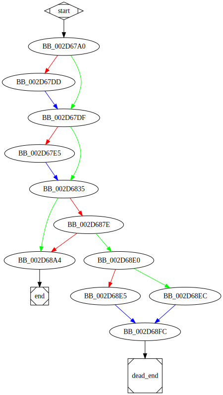

# sub_4067A0 function

## Tasks

- [ ] Add Description.
- [ ] Add Syntax.
- [X] Add Assembly.
- [ ] Add Source.
- [ ] Add Arguments.
- [ ] Add Return Value.
- [X] Add Dependencies.
- [X] Add Used By.
- [X] Add Graph.
- [ ] Add Flow.
- [ ] Add Pseudo-code.
- [ ] Fully documented (Including dependencies).

## Description

(Add description.)

## Syntax

(Add syntax.)

## Assembly

Go to [assembly](../asm/sub_4067A0.asm).

## Source

Go to [source](../cc/sub_4067A0.cc).

## Arguments

(Add arguments.)

## Return Value

(Add return value.)

## Dependencies

* Function dependencies:
  * [`sub_406930`](sub_406930.md) ❓
  * [`sub_406650`](sub_406650.md) ✅
  * [`sub_419970`](sub_419970.md) ❓
  * `?make_error_code@std@@YA?AVerror_code@1@W4io_errc@1@@Z_0` ⌛
  * [`sub_407ED0`](sub_407ED0.md) ❓
  * [`sub_3098A0`](sub_3098A0.md) ✅

* Data dependencies:
  * [`unk_341060`](unk_341060.md) ⌛
  * [`unk_341068`](unk_341068.md) ⌛
  * `??_7ios_base@std@@6B@` ⌛
  * `??_7?$basic_ios@DU?$char_traits@D@std@@@std@@6B@` ⌛
  * `??_7?$basic_fstream@DU?$char_traits@D@std@@@std@@6B@` ⌛
  * [`aIosBaseBadbitS`](aIosBaseBadbitS.md) ⌛
  * [`aIosBaseFailbit`](aIosBaseFailbit.md) ⌛
  * [`aIosBaseEofbitS`](aIosBaseEofbitS.md) ⌛
  * `__TI5?AVfailure@ios_base@std@@` ⌛

## Used By

* Used by functions:
  * [`sub_40FCB0`](sub_40FCB0.md)

## Graph

## Flow

(Add flow.)

## Pseudo-code

(Add pseudo-code.)

