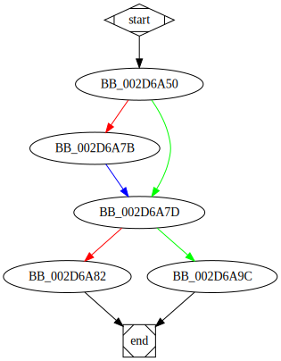

# sub_406A50 function

## Tasks

- [ ] Add Description.
- [ ] Add Syntax.
- [X] Add Assembly.
- [ ] Add Source.
- [ ] Add Arguments.
- [ ] Add Return Value.
- [X] Add Dependencies.
- [X] Add Used By.
- [X] Add Graph.
- [ ] Add Flow.
- [ ] Add Pseudo-code.
- [ ] Fully documented (Including dependencies).

## Description

(Add description.)

## Syntax

(Add syntax.)

## Assembly

Go to [assembly](../asm/sub_406A50.asm).

## Source

Go to [source](../cc/sub_406A50.cc).

## Arguments

(Add arguments.)

## Return Value

(Add return value.)

## Dependencies

* Function dependencies:
  * [`sub_2E3350`](sub_2E3350.md)
  * [`_memmove`](_memmove.md)

## Used By

* Used by functions:
  * [`sub_2F1320`](sub_2F1320.md)
  * [`StartAddress`](StartAddress.md)

## Graph

## Flow

(Add flow.)

## Pseudo-code

(Add pseudo-code.)

