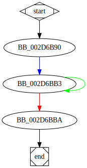

# sub_406B90 function

## Tasks

- [ ] Add Description.
- [ ] Add Syntax.
- [ ] Add Assembly.
- [ ] Add Source.
- [ ] Add Arguments.
- [ ] Add Return Value.
- [ ] Add Dependencies.
- [ ] Add Used By.
- [ ] Add Graph.
- [ ] Add Flow.
- [ ] Add Pseudo-code.
- [ ] Fully documented (Including dependencies).

## Description

This function is a method of an unknown class. It initializes some fields of the `Object`. It also counts the length of `Src`.

## Arguments

* `Object` : An object of an unknown class.
* `Src` : First argument.

## Return Value

`Object` : The method returns a pointer to the `Object`.

## Dependencies

* Function dependencies:
  * [`sub_413BA0`](sub_413BA0.md)

## Used By

* Used by functions:
  * [`_main`](_main.md)

## Graph



## Remarks

### Object Structure

```c
struct {
  int a;
  char b[12]; //Unused
  int c;
  int d;
};
```
