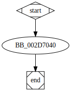

# sub_407040 function

## Tasks

- [ ] Add Description.
- [ ] Add Syntax.
- [ ] Add Assembly.
- [ ] Add Source.
- [ ] Add Arguments.
- [ ] Add Return Value.
- [ ] Add Dependencies.
- [ ] Add Used By.
- [ ] Add Graph.
- [ ] Add Flow.
- [ ] Add Pseudo-code.
- [ ] Fully documented (Including dependencies).

## Description

## Arguments

## Return Value

(Add return value.)

## Dependencies

* Function dependencies:
  * [`??2@YAPAXI@Z`](%3F%3F2%40YAPAXI%40Z.md)
  * [`sub_2E02E0`](sub_2E02E0.md)

## Used By

* Used by functions:
  * [`_main`](_main.md)

## Graph

