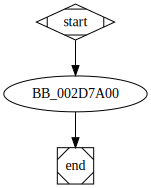

# sub_407A00 function

## Tasks

- [ ] Add Description.
- [ ] Add Syntax.
- [ ] Add Assembly.
- [ ] Add Source.
- [ ] Add Arguments.
- [ ] Add Return Value.
- [ ] Add Dependencies.
- [ ] Add Used By.
- [ ] Add Graph.
- [ ] Add Flow.
- [ ] Add Pseudo-code.
- [ ] Fully documented (Including dependencies).

## Description


## Syntax

```c

```

## Arguments


## Return Value

(Add return value.)

## Dependencies

* Function dependencies:
  * None.

* Data dependencies:
  * `??_7exception@std@@6B@`
  * [`aBadArrayNewLen`](aBadArrayNewLen.md)
  * `??_7bad_alloc@std@@6B@`
  * `??_7bad_array_new_length@std@@6B@`

## Used By

* Used by functions:
  * [`sub_2E29D0`](sub_2E29D0.md)

## Graph



