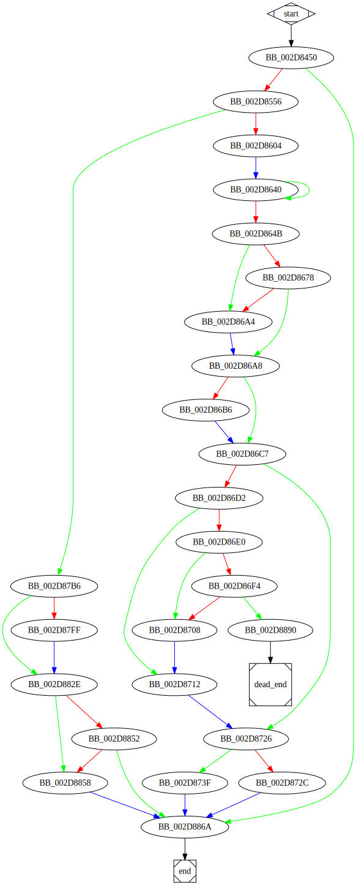

# sub_408450 function

## Tasks

- [ ] Add Description.
- [ ] Add Syntax.
- [X] Add Assembly.
- [ ] Add Source.
- [ ] Add Arguments.
- [ ] Add Return Value.
- [X] Add Dependencies.
- [X] Add Used By.
- [X] Add Graph.
- [ ] Add Flow.
- [ ] Add Pseudo-code.
- [ ] Fully documented (Including dependencies).

## Description

(Add description.)

## Syntax

(Add syntax.)

## Assembly

Go to [assembly](../asm/sub_408450.asm).

## Source

Go to [source](../cc/sub_408450.cc).

## Arguments

(Add arguments.)

## Return Value

(Add return value.)

## Dependencies

* Function dependencies:
  * [`sub_406BD0`](sub_406BD0.md) ✔️
  * [`_memset`](_memset.md) ⌛
  * [`sub_4058D0`](sub_4058D0.md) ❓
  * [`sub_41A1C0`](sub_41A1C0.md) ✔️
  * [`sub_40B0D0`](sub_40B0D0.md) ❓
  * [`FindFirstFileW`Docs](https://docs.microsoft.com/en-us/windows/win32/api/fileapi/nf-fileapi-findfirstfilew)
  * [`sub_412C40`](sub_412C40.md) ✔️
  * [`sub_413C90`](sub_413C90.md) ✔️
  * [`sub_402C50`](sub_402C50.md) ❓
  * [`sub_406D40`](sub_406D40.md) ❓
  * [`sub_43851F`](sub_43851F.md) ✔️
  * [`sub_4185D0`](sub_4185D0.md) ✔️
  * [`sub_408A90`](sub_408A90.md) ✔️
  * [`sub_40B050`](sub_40B050.md) ❓
  * [`sub_40A4B0`](sub_40A4B0.md) ❓
  * [`sub_4144B0`](sub_4144B0.md) ✔️
  * [`GetLastError`Docs](https://docs.microsoft.com/en-us/windows/win32/api/errhandlingapi/nf-errhandlingapi-getlasterror)
  * [`@__security_check_cookie@4`](@__security_check_cookie@4.md) ⌛
  * [`__invalid_parameter_noinfo_noreturn`](__invalid_parameter_noinfo_noreturn.md) ⌛

* Data dependencies:
  * [`off_487548`](off_487548.md) ⌛
  * [`unk_470D78`](unk_470D78.md) ⌛
  * [`asc_470F88`](asc_470F88.md) ⌛
  * [`asc_470F8C`](asc_470F8C.md) ⌛

## Used By

* Used by functions:
  * [`sub_407CE0`](sub_407CE0.md)

## Graph

## Flow

(Add flow.)

## Pseudo-code

(Add pseudo-code.)

