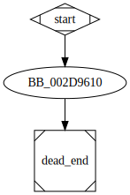

# sub_2D9610 function

## Tasks

- [ ] Add Description.
- [ ] Add Syntax.
- [ ] Add Assembly.
- [ ] Add Source.
- [ ] Add Arguments.
- [ ] Add Return Value.
- [ ] Add Dependencies.
- [ ] Add Used By.
- [ ] Add Graph.
- [ ] Add Flow.
- [ ] Add Pseudo-code.
- [ ] Fully documented (Including dependencies).

## Description

This function jumps to the function [`sub_2E2BC0`](sub_2E2BC0.md).

## Arguments

## Return Value

Undetermined, because the function jumps to another function.

## Dependencies

* Function dependencies:
  * [`sub_2E2BC0`](sub_2E2BC0.md)

## Used By

* Used by functions:
  * [`_main`](_main.md)

## Graph

