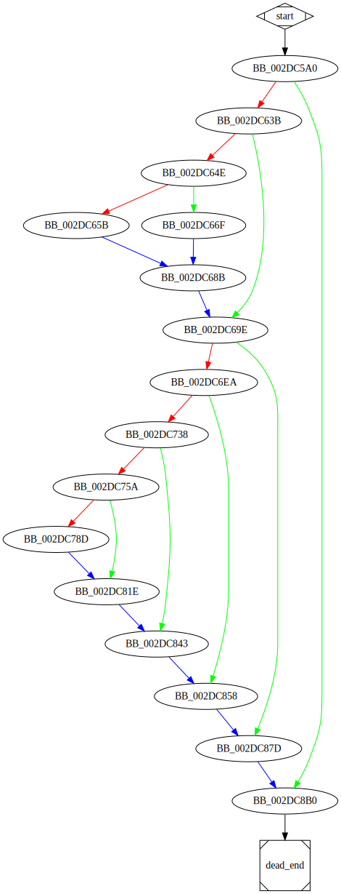

# sub_40C5A0 function

## Tasks

- [X] Add Description.
- [ ] Add Syntax.
- [X] Add Assembly.
- [ ] Add Source.
- [ ] Add Arguments.
- [ ] Add Return Value.
- [X] Add Dependencies.
- [X] Add Used By.
- [X] Add Graph.
- [ ] Add Flow.
- [X] Add Pseudo-code.
- [ ] Fully documented (Including dependencies).

## Description

This function is possibly responsible for infecting the machine and performing file encryption.

## Syntax

(Add syntax.)

## Assembly

Go to [assembly](../asm/sub_40C5A0.asm).

## Source

Go to [source](../cc/sub_40C5A0.cc).

## Arguments

(Add arguments.)

## Return Value

(Add return value.)

## Dependencies

* Function dependencies:
  * [`sub_4026D0`](sub_4026D0.md) ✔️
  * [`sub_41D330`](sub_41D330.md) ❓
  * [`sub_41AB20`](sub_41AB20.md) ❓
  * [`sub_4176E0`](sub_4176E0.md) ❓
  * [`sub_40FE80`](sub_40FE80.md) ✔️ 🔥
  * [`StartServiceCtrlDispatcherW`<sup>Docs</sup>](https://docs.microsoft.com/en-us/windows/win32/api/winsvc/nf-winsvc-startservicectrldispatcherw)
  * [`OpenSCManagerW`<sup>Docs</sup>](https://docs.microsoft.com/en-us/windows/win32/api/winsvc/nf-winsvc-openscmanagerw)
  * [`GetLastError`<sup>Docs</sup>](https://docs.microsoft.com/en-us/windows/win32/api/errhandlingapi/nf-errhandlingapi-getlasterror)
  * [`sub_40A700`](sub_40A700.md) ❓
  * [`sub_40A8D0`](sub_40A8D0.md) ❓
  * [`__loaddll`](__loaddll.md) ❓
  * [`sub_40F650`](sub_40F650.md) ✔️ 🔥
  * [`sub_406BD0`](sub_406BD0.md) ✔️
  * [`sub_40C8E0`](sub_40C8E0.md) ✔️ 🔥
  * [`GetSystemMetrics`<sup>Docs</sup>](https://docs.microsoft.com/en-us/windows/win32/api/winuser/nf-winuser-getsystemmetrics)
  * [`sub_40A530`](sub_40A530.md) ❓
  * [`RegOpenKeyExW`<sup>Docs</sup>](https://docs.microsoft.com/en-us/windows/win32/api/winreg/nf-winreg-regopenkeyexw)
  * [`sub_40CEE0`](sub_40CEE0.md) ⌛ 🔥
  * [`sub_43DC04`](sub_43DC04.md) ✔️
  * [`sub_40FCB0`](sub_40FCB0.md) ✔️ 🔥
  * [`sub_40A440`](sub_40A440.md) ✔️
  * [`sub_409620`](sub_409620.md) ❓
  * [`sub_410280`](sub_410280.md) ✔️ 🔥
  * [`ShellExecuteA`<sup>Docs</sup>](https://docs.microsoft.com/en-us/windows/win32/api/shellapi/nf-shellapi-shellexecutea)
  * [`sub_40EA60`](sub_40EA60.md) ❓

* Data dependencies:
  * [`aEncryption`](aEncryption.md) ✔️
  * [`unk_489670`](unk_489670.md) ✔️
  * [`dword_487290`](dword_487290.md) ✔️
  * [`lpServiceName`](lpServiceName.md) ✔️
  * [`aPleaseRunProgr`](aPleaseRunProgr.md) ✔️
  * [`aCantOpenScmMan`](aCantOpenScmMan.md) ✔️
  * [`sub_404910`](sub_404910.md) ❓
  * [`xmmword_4871D4`](xmmword_4871D4.md) ❓
  * [`aBootOption`](aBootOption.md) ✔️
  * [`SubKey`](SubKey.md) ✔️
  * [`aBcdeditSetSafe`](aBcdeditSetSafe.md) ✔️
  * [`aCWindowsSystem`](aCWindowsSystem.md) ✔️
  * [`aCWindowsSysnat`](aCWindowsSysnat.md) ✔️
  * [`unk_487294`](unk_487294.md) ❓
  * [`Parameters`](Parameters.md) ✔️
  * [`File`](File.md) ✔️
  * [`Operation`](Operation.md) ✔️
  * [`aErrorWhileAddi`](aErrorWhileAddi.md) ✔️
  * [`aThisProgramNee`](aThisProgramNee.md) ✔️
  * [`aErrorWhileCrea`](aErrorWhileCrea.md) ✔️
  * [`aStartedAsServi`](aStartedAsServi.md) ✔️

## Used By

* Used by functions:
  * [`_main`](_main.md)

## Graph



## Flow

(Add flow.)

## Pseudo-code

### BB_0040C5A0

```c
v1 = sub_4026D0(unk_489670, aEncryption);
v2 = v1;
v3 = v2->Dword00;
v4 = v3->Dword04;
v5 = v4 + v2;
v6 = sub_41D330(v5, 0xA); //UnknownObject.sub_41D330(...)
v7 = v6;
v8 = v2;
v9 = sub_41AB20(v8, v7); //UnknownObject.sub_41AB20(...)
v10 = v2;
v11 = sub_4176E0(v10); //UnknownObject.sub_4176E0(...)
v12 = dword_487290 >= 8;
v13 = lpServiceName;
ServiceStartTable.lpServiceProc = sub_40FE80;
v14 = lpServiceName;
v15 = v12 ? v14: v13; //v15 = phi(v13, v14);
ServiceStartTable.lpServiceName = v15;
v16 = &ServiceStartTable;
var_38 = 0;
var_34 = 0;
v17 = StartServiceCtrlDispatcherW(v16);
if (v17 == 0) {
  //BB_0040C63B
  //...
}
//BB_0040C8B0
//...
```

### BB_0040C63B

```c
v18 = OpenSCManagerW(v17, v17, 0xF003F);
v19 = v18;
if (v19 == 0) {
  //BB_0040C64E
  //...
}
//BB_0040C69E
//...
```

### BB_0040C64E

```c
v20 = GetLastError();
if (v20 == 5) {
  //BB_0040C65B
  //...
}
//BB_0040C66F
//...
```

### BB_0040C65B

```c
v21 = sub_4026D0(unk_489670, aPleaseRunProgr);
//BB_0040C68B
//...
```

### BB_0040C66F

```c
v22 = GetLastError();
v23 = sub_4026D0(unk_489670, aCantOpenScmMan);
v24 = v23;
v25 = sub_40A700(v24);
//BB_0040C68B
//...
```

### BB_0040C68B

```c
v26 = sub_40A8D0(v25, sub_404910);
v27 = __loaddll(0);
//BB_0040C69E
//...
```

### BB_0040C69E

```c
v28 = sub_40F650();
v29 = _alloca(0x18);
v30 = v29;
phkResult = v29;
v31 = sub_406BD0(xmmword_4871D4);
var_4 = 0;
v32 = _alloca(0x18);
v33 = v32;
var_30 = v32;
v34 = sub_406BD0(lpServiceName);
var_4 = 1;
var_4 = 0xFFFFFFFF;
v35 = (v19 != 0) ? v19: GetLastError; //phi
v36 = sub_40C8E0(v35);
if (v36 != 0) {
  //BB_0040C6EA
  //...
}
//BB_0040C87D
//...

```

### BB_0040C6EA

```c
v37 = GetSystemMetrics(0x43);
v38 = v37;
v39 = sub_4026D0(unk_489670, aBootOption);
v40 = v39;
v41 = sub_40A530(v40); //UnknownObject.sub_40A530(...)
v42 = v41;
v43 = v42->Dword00;
v44 = v43->Dword04;
v45 = v44 + v42;
v46 = sub_41D330(v45, 0xA); //UnknownObject.sub_41D330(...)
v47 = v46;
v48 = v42;
v49 = sub_41AB20(v48, v47); //UnknownObject.sub_41AB20(...)
v50 = v42;
v51 = sub_4176E0(v50); //UnknownObject.sub_4176E0(...)
if (v38 == 0) {
  //BB_0040C738
  //...
}
//BB_0040C858
//...
```

### BB_0040C738

```c
v52 = RegOpenKeyExW(0x80000002, SubKey, v38, 0x103, &phkResult);
if (v52 == 0) {
  //BB_0040C75A
  //...
}
//BB_0040C843
//..
```

### BB_0040C75A

```c
v53 = _alloca(0x18);
v54 = v53;
var_30 = v53;
v55 = sub_406BD0(lpServiceName);
var_4 = 2;
var_4 = 0xFFFFFFFF;
v56 = sub_40CEE0(phkResult);
if (v56 != 0) {
  //BB_0040C78D
  //...
}
//BB_0040C81E
//...
```

### BB_0040C78D

```c
v57 = sub_43DC04(aBcdeditSetSafe);
v58 = sub_43DC04(aCWindowsSystem);
v59 = sub_43DC04(aCWindowsSysnat);
v60 = &var_28;
v61 = sub_40FCB0(v60);
var_4 = 3;
v62 = unk_487294;
v63 = sub_40A440(v61);
var_4 = 0xFFFFFFFF;
v64 = &var_28;
v65 = sub_409620(v64); //UnknownObject.sub_409620(...)
v66 = _alloca(0x18);
v67 = v66;
var_30 = v66;
v68 = sub_406BD0(unk_487294);
var_4 = 4;
var_4 = 0xFFFFFFFF;
v69 = sub_410280();
v70 = ShellExecuteA(v38, Operation, File, Parameters, v38, v38);
v71 = __loaddll(v38);
//BB_0040C81E
//...
```

### BB_0040C81E

```c
v72 = sub_4026D0(unk_489670, aErrorWhileAddi);
v73 = sub_40A8D0(v72, sub_404910); //UnknownObject.sub_40A8D0(...)
v74 = __loaddll(0);
//BB_0040C843
//...
```

### BB_0040C843

```c
v75 = sub_40EA60(v74, 0x2E0);
v76 = __loaddll(0);
//BB_0040C858
//...
```

### BB_0040C858

```c
v77 = sub_4026D0(unk_489670, aThisProgramNee);
v78 = v77;
v79 = sub_40A8D0(v78, sub_404910); //UnknownObject.sub_40A8D0(...)
v80 = __loaddll(0);
//BB_0040C87D
//...
```

### BB_0040C87D

```c
v81 = GetLastError();
v82 = sub_4026D0(unk_489670, aErrorWhileCrea);
v83 = v82;
v84 = sub_40A700(v83, v81);
v85 = v84;
v86 = sub_40A8D0(v85, sub_404910);
v87 = __loaddll(0);
//BB_0040C8B0
//...
```

### BB_0040C8B0

```c
v88 = sub_4026D0(unk_489670, aStartedAsServi);
v89 = v88;
v90 = sub_40A8D0(v89, sub_404910);
v91 = __loaddll(0);
//dead_end
```

