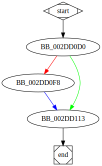

# sub_2DD0D0 function

## Tasks

- [X] Add Description.
- [X] Add Syntax.
- [X] Add Assembly.
- [ ] Add Source.
- [ ] Add Arguments.
- [ ] Add Return Value.
- [X] Add Dependencies.
- [X] Add Used By.
- [X] Add Graph.
- [ ] Add Flow.
- [ ] Add Pseudo-code.
- [ ] Fully documented (Including dependencies).

## Description

This function changes the *Service Start Type* to `SERVICE_DISABLED`.

## Syntax

```c
DWORD sub_2DD0D0(LPCWSTR lpServiceName)
{...}
```

## Assembly

Go to [assembly](../asm/sub_2DD0D0.asm).

## Source

Go to [source](../cc/sub_2DD0D0.cc).

## Arguments

* `lpServiceName` : The name of the service to disable

## Return Value

(Add return value.)

## Dependencies

* Function dependencies:
  * [`OpenSCManagerW`<sup>Docs</sup>](https://docs.microsoft.com/en-us/windows/win32/api/winsvc/nf-winsvc-openscmanagerw)
  * [`OpenServiceW`<sup>Docs</sup>](https://docs.microsoft.com/en-us/windows/win32/api/winsvc/nf-winsvc-openservicew)
  * [`ChangeServiceConfigA`<sup>Docs</sup>](https://docs.microsoft.com/en-us/windows/win32/api/winsvc/nf-winsvc-changeserviceconfiga)
  * [`CloseServiceHandle`<sup>Docs</sup>](https://docs.microsoft.com/en-us/windows/win32/api/winsvc/nf-winsvc-closeservicehandle)


* Data dependencies:
  * None.

## Used By

* Used by functions:
  * [`StartAddress`](StartAddress.md)

## Graph



## Flow

(Add flow.)

## Pseudo-code

(Add pseudo-code.)
