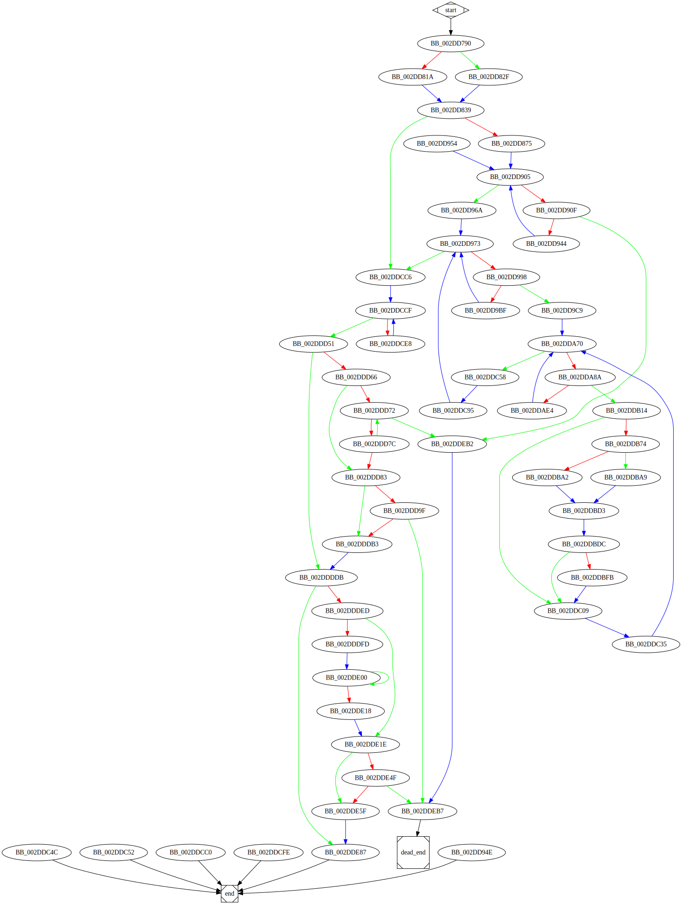

# sub_40D790 function

## Tasks

- [ ] Add Description.
- [ ] Add Syntax.
- [X] Add Assembly.
- [ ] Add Source.
- [ ] Add Arguments.
- [ ] Add Return Value.
- [X] Add Dependencies.
- [X] Add Used By.
- [X] Add Graph.
- [ ] Add Flow.
- [ ] Add Pseudo-code.
- [ ] Fully documented (Including dependencies).

## Description

(Add description.)

## Syntax

(Add syntax.)

## Assembly

Go to [assembly](../asm/sub_40D790.asm).

## Source

Go to [source](../cc/sub_40D790.cc).

## Arguments

(Add arguments.)

## Return Value

(Add return value.)

## Dependencies

* Function dependencies:
  * `??2@YAPAXI@Z`
  * [`sub_4024F0`](sub_4024F0.md) ✔️
  * [`sub_2E7120`](sub_2E7120.md) ✔️
  * [`sub_2E2C40`](sub_2E2C40.md) ✔️
  * [`sub_2EA990`](sub_2EA990.md) ❓
  * [`sub_40AEC0`](sub_40AEC0.md) ❓
  * [`sub_40CD30`](sub_40CD30.md) ❓
  * [`unknown_libname_5`](unknown_libname_5.md) ✔️
  * [`sub_402410`](sub_402410.md) ✔️
  * [`sub_2EAAD0`](sub_2EAAD0.md) ❓
  * [`Sleep`Docs](https://docs.microsoft.com/en-us/windows/win32/api/synchapi/nf-synchapi-sleep)
  * [`sub_2E3DA0`](sub_2E3DA0.md) ❓
  * [`sub_408B20`](sub_408B20.md) ❓
  * [`sub_40F520`](sub_40F520.md) ✔️
  * [`sub_407BC0`](sub_407BC0.md) ❓
  * [`sub_407B50`](sub_407B50.md) ❓
  * [`sub_2E3E10`](sub_2E3E10.md) ❓
  * [`sub_2E6F20`](sub_2E6F20.md) ✔️
  * [`sub_40AE70`](sub_40AE70.md) ❓
  * [`sub_406BD0`](sub_406BD0.md) ✔️
  * [`sub_40EAA0`](sub_40EAA0.md) ✔️
  * [`sub_40AF30`](sub_40AF30.md) ❓
  * [`sub_2E2F10`](sub_2E2F10.md) ✔️
  * [`sub_408A90`](sub_408A90.md) ✔️
  * [`sub_407010`](sub_407010.md) ❓
  * [`sub_2E92E0`](sub_2E92E0.md) ✔️
  * [`sub_2EAA40`](sub_2EAA40.md) ❓
  * [`sub_2ED260`](sub_2ED260.md) ❓
  * [`__Mtx_unlock`](__Mtx_unlock.md) ⌛
  * [`sub_409F60`](sub_409F60.md) ❓
  * [`sub_2E7060`](sub_2E7060.md) ❓
  * [`sub_2E3DE0`](sub_2E3DE0.md) ❓
  * [`sub_2E9310`](sub_2E9310.md) ❓
  * [`sub_4026D0`](sub_4026D0.md) ✔️
  * [`sub_2ED330`](sub_2ED330.md) ❓
  * [`sub_2EAB20`](sub_2EAB20.md) ❓
  * [`sub_2E76E0`](sub_2E76E0.md) ❓
  * [`sub_30851F`](sub_30851F.md) ✔️
  * [`sub_2E2BC0`](sub_2E2BC0.md) ✔️
  * [`@__security_check_cookie@4`](@__security_check_cookie@4.md) ⌛
  * [`_terminate`](_terminate.md) ⌛
  * [`__invalid_parameter_noinfo_noreturn`](__invalid_parameter_noinfo_noreturn.md) ⌛

* Data dependencies:
  * [`off_357548`](off_357548.md) ⌛
  * [`dword_35719C`](dword_35719C.md) ⌛
  * [`sub_40DEE0`](sub_40DEE0.md) ⌛
  * [`loc_2DD954`](loc_2DD954.md) ⌛
  * [`dword_3592D8`](dword_3592D8.md) ⌛
  * [`dword_3592D4`](dword_3592D4.md) ⌛
  * [`unk_3592A4`](unk_3592A4.md) ⌛
  * [`loc_2DDBDC`](loc_2DDBDC.md) ⌛
  * [`loc_2DDC35`](loc_2DDC35.md) ⌛
  * [`loc_2DDC95`](loc_2DDC95.md) ⌛
  * [`byte_357198`](byte_357198.md) ⌛
  * [`aError755`](aError755.md) ⌛
  * [`unk_359670`](unk_359670.md) ⌛
  * [`loc_2DDD51`](loc_2DDD51.md) ⌛

## Used By

* Used by functions:
  * [`StartAddress`](StartAddress.md)

## Graph

## Flow

(Add flow.)

## Pseudo-code

(Add pseudo-code.)
