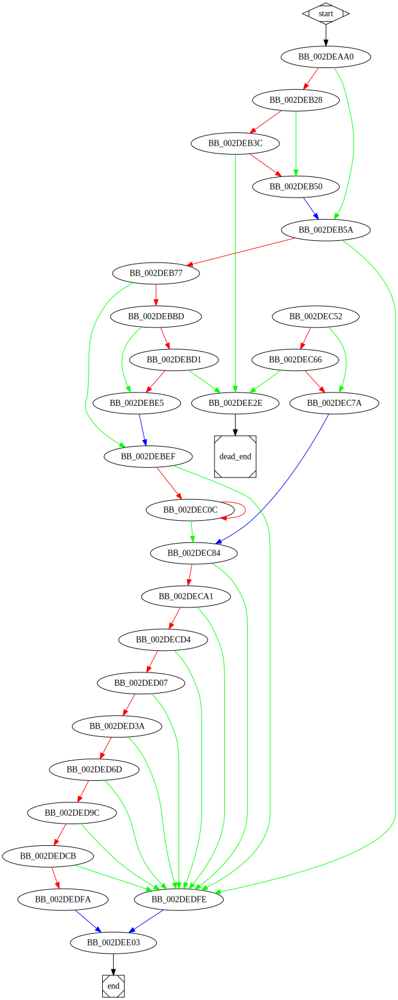

# sub_40EAA0 function

## Tasks

- [ ] Add Description.
- [ ] Add Syntax.
- [X] Add Assembly.
- [ ] Add Source.
- [ ] Add Arguments.
- [ ] Add Return Value.
- [X] Add Dependencies.
- [X] Add Used By.
- [X] Add Graph.
- [ ] Add Flow.
- [ ] Add Pseudo-code.
- [ ] Fully documented (Including dependencies).

## Description

(Add description.)

## Syntax

(Add syntax.)

## Assembly

Go to [assembly](../asm/sub_40EAA0.asm).

## Source

Go to [source](../cc/sub_40EAA0.cc).

## Arguments

(Add arguments.)

## Return Value

(Add return value.)

## Dependencies

* Function dependencies:
  * [`sub_413C90`](sub_413C90.md) ✅
  * [`sub_4174A0`](sub_4174A0.md) ❓
  * [`sub_43851F`](sub_43851F.md) ✅
  * [`sub_406D40`](sub_406D40.md) ❓
  * [`sub_412C40`](sub_412C40.md) ✅
  * [`@__security_check_cookie@4`](@__security_check_cookie@4.md) ⌛
  * [`__invalid_parameter_noinfo_noreturn`](__invalid_parameter_noinfo_noreturn.md) ⌛ 

* Data dependencies:
  * [`aRecycleBin`](aRecycleBin.md) ⌛
  * [`aWindows`](aWindows.md) ⌛
  * [`aLocalSettings`](aLocalSettings.md) ⌛
  * [`aApplicationDat`](aApplicationDat.md) ⌛
  * [`aOutTxt`](aOutTxt.md) ⌛
  * [`aBoot`](aBoot.md) ⌛
  * [`aReadmeTxt`](aReadmeTxt.md) ⌛
  * [`aDlaksjdoiwqJpg`](aDlaksjdoiwqJpg.md) ⌛
  * [`aNtuserDat`](aNtuserDat.md) ⌛
  * [`aFkdjsadasdIco`](aFkdjsadasdIco.md) ⌛

## Used By

* Used by functions:
  * [`sub_40D790`](sub_40D790.md)

## Graph

## Flow

(Add flow.)

## Pseudo-code

(Add pseudo-code.)
