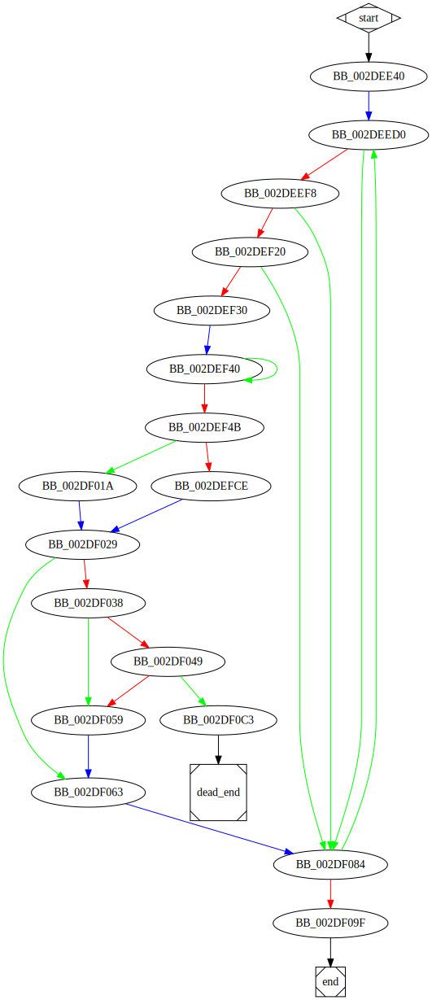

# sub_40EE40 function

## Tasks

- [X] Add Description.
- [ ] Add Syntax.
- [X] Add Assembly.
- [ ] Add Source.
- [ ] Add Arguments.
- [ ] Add Return Value.
- [X] Add Dependencies.
- [X] Add Used By.
- [X] Add Graph.
- [ ] Add Flow.
- [ ] Add Pseudo-code.
- [ ] Fully documented (Including dependencies).

## Description

This function scans the volumes of the computer.

## Syntax

(Add syntax.)

## Assembly

Go to [assembly](../asm/sub_40EE40.asm).

## Source

Go to [source](../cc/sub_40EE40.cc).

## Arguments

(Add arguments.)

## Return Value

(Add return value.)

## Dependencies

* Function dependencies:
  * [`FindFirstVolumeW`Docs](https://docs.microsoft.com/en-us/windows/win32/api/fileapi/nf-fileapi-findfirstvolumew)
  * [`GetVolumePathNamesForVolumeNameW`Docs](https://docs.microsoft.com/en-us/windows/win32/api/fileapi/nf-fileapi-getvolumepathnamesforvolumenamew)
  * [`GetVolumeInformationW`Docs](https://docs.microsoft.com/en-us/windows/win32/api/fileapi/nf-fileapi-getvolumeinformationw)
  * [`sub_2EB200`](sub_2EB200.md) ✔️
  * [`sub_403230`](sub_403230.md) ❓
  * [`sub_403640`](sub_403640.md) ❓
  * [`sub_30851F`](sub_30851F.md) ✔️
  * [`FindNextVolumeW`Docs](https://docs.microsoft.com/en-us/windows/win32/api/fileapi/nf-fileapi-findnextvolumew)
  * [`FindVolumeClose`Docs](https://docs.microsoft.com/en-us/windows/win32/api/fileapi/nf-fileapi-findvolumeclose)
  * [`@__security_check_cookie@4`](@__security_check_cookie@4.md) ⌛
  * [`__invalid_parameter_noinfo_noreturn`](__invalid_parameter_noinfo_noreturn.md) ⌛

* Data dependencies:
  * None.

## Used By

* Used by functions:
  * [`StartAddress`](StartAddress.md)

## Graph

## Flow

(Add flow.)

## Pseudo-code

(Add pseudo-code.)

