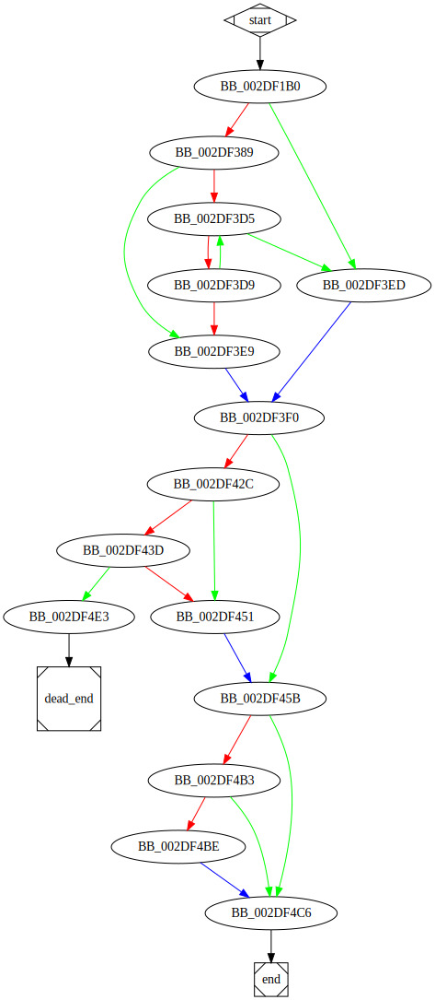

# sub_40F1B0 function

## Tasks

- [ ] Add Description.
- [ ] Add Syntax.
- [X] Add Assembly.
- [ ] Add Source.
- [ ] Add Arguments.
- [ ] Add Return Value.
- [X] Add Dependencies.
- [X] Add Used By.
- [X] Add Graph.
- [ ] Add Flow.
- [ ] Add Pseudo-code.
- [ ] Fully documented (Including dependencies).

## Description

(Add description.)

## Syntax

(Add syntax.)

## Assembly

Go to [assembly](../asm/sub_40F1B0.asm).

## Source

Go to [source](../cc/sub_40F1B0.cc).

## Arguments

(Add arguments.)

## Return Value

(Add return value.)

## Dependencies

* Function dependencies:
  * [`sub_4071D0`](sub_4071D0.md) ✔️
  * [`GetModuleFileNameW`Docs](https://docs.microsoft.com/en-us/windows/win32/api/libloaderapi/nf-libloaderapi-getmodulefilenamew)
  * [`sub_41B200`](sub_41B200.md) ✔️
  * [`sub_403230`](sub_403230.md) ❓
  * [`sub_413BA0`](sub_413BA0.md) ✔️
  * [`sub_4178B0`](sub_4178B0.md) ✔️
  * [`sub_412C40`](sub_412C40.md) ✔️
  * [`_memset`](_memset.md) ⌛
  * [`sub_41AF90`](sub_41AF90.md) ❓
  * [`sub_406A50`](sub_406A50.md) ✔️
  * [`sub_43851F`](sub_43851F.md) ✔️
  * [`sub_412C40`](sub_412C40.md) ✔️
  * [`sub_412BC0`](sub_412BC0.md) ✔️
  * [`@__security_check_cookie@4`](@__security_check_cookie@4.md) ⌛
  * [`__invalid_parameter_noinfo_noreturn`](__invalid_parameter_noinfo_noreturn.md) ⌛

* Data dependencies:
  * [`dword_4871BC`](dword_4871BC.md) ⌛
  * [`dword_4871D0`](dword_4871D0.md) ⌛
  * [`dword_4871CC`](dword_4871CC.md) ⌛
  * [`xmmword_3571D4`](xmmword_4871D4.md) ⌛
  * [`qword_4871E4`](qword_4871E4.md) ⌛
  * [`byte_470C84`](byte_470C84.md) ⌛
  * `??_7?$wstring_convert@V?$codecvt_utf8_utf16@_W$0BAPPPP@$0A@@std@@_WV?$allocator@_W@2@V?$allocator@D@2@@std@@6B@`

## Used By

* Used by functions:
  * [`sub_40F650`](sub_40F650.md)

## Graph

## Flow

(Add flow.)

## Pseudo-code

(Add pseudo-code.)

