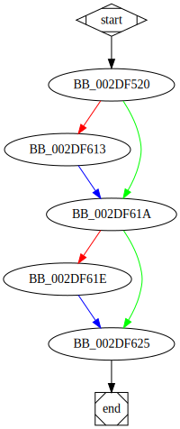

# sub_40F520 function

## Tasks

- [ ] Add Description.
- [ ] Add Syntax.
- [X] Add Assembly.
- [ ] Add Source.
- [ ] Add Arguments.
- [ ] Add Return Value.
- [X] Add Dependencies.
- [X] Add Used By.
- [X] Add Graph.
- [ ] Add Flow.
- [ ] Add Pseudo-code.
- [ ] Fully documented (Including dependencies).

## Description

(Add description.)

## Syntax

(Add syntax.)

## Assembly

Go to [assembly](../asm/sub_40F520.asm).

## Source

Go to [source](../cc/sub_40F520.cc).

## Arguments

(Add arguments.)

## Return Value

(Add return value.)

## Dependencies

* Function dependencies:
  * [`SetEntriesInAclW`Docs](https://docs.microsoft.com/en-us/windows/win32/api/aclapi/nf-aclapi-setentriesinaclw)
  * [`LocalAlloc`Docs](https://docs.microsoft.com/en-us/windows/win32/api/winbase/nf-winbase-localalloc)
  * [`InitializeSecurityDescriptor`Docs](https://docs.microsoft.com/en-us/windows/win32/api/securitybaseapi/nf-securitybaseapi-initializesecuritydescriptor)
  * [`SetSecurityDescriptorDacl`Docs](https://docs.microsoft.com/en-us/windows/win32/api/securitybaseapi/nf-securitybaseapi-setsecuritydescriptordacl)
  * [`sub_406BD0`](sub_406BD0.md) ✅
  * [`SetFileSecurityW`Docs](https://docs.microsoft.com/en-us/windows/win32/api/securitybaseapi/nf-securitybaseapi-setfilesecurityw)
  * [`sub_412C40`](sub_412C40.md) ✅
  * [`__imp_LocalFree`Docs](https://docs.microsoft.com/en-us/windows/win32/api/winbase/nf-winbase-localfree)
  * [`@__security_check_cookie@4`](@__security_check_cookie@4.md) ⌛

* Data dependencies:
  * None.

## Used By

* Used by functions:
  * [`sub_40D790`](sub_40D790.md)

## Graph

## Flow

(Add flow.)

## Pseudo-code

(Add pseudo-code.)
