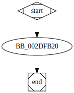

# sub_40FB20 function

## Tasks

- [ ] Add Description.
- [ ] Add Syntax.
- [X] Add Assembly.
- [ ] Add Source.
- [ ] Add Arguments.
- [ ] Add Return Value.
- [X] Add Dependencies.
- [X] Add Used By.
- [X] Add Graph.
- [ ] Add Flow.
- [ ] Add Pseudo-code.
- [ ] Fully documented (Including dependencies).

## Description

(Add description.)

## Syntax

(Add syntax.)

## Assembly

Go to [assembly](../asm/sub_40FB20.asm).

## Source

Go to [source](../cc/sub_40FB20.cc).

## Arguments

(Add arguments.)

## Return Value

(Add return value.)

## Dependencies

* Function dependencies:
  * [`sub_43DC04`](sub_43DC04.md) ✅
  * [`ShellExecuteA`Docs](https://docs.microsoft.com/en-us/windows/win32/api/shellapi/nf-shellapi-shellexecutea)

* Data dependencies:
  * [`aBcdeditDeletev`](aBcdeditDeletev.md) ⌛
  * [`aCWindowsSystem_1`](aCWindowsSystem_1.md) ⌛
  * [`aCWindowsSysnat_1`](aCWindowsSysnat_1.md) ⌛
  * [`Parameters`](Parameters.md) ⌛
  * [`File`](File.md) ⌛
  * [`Operation`](Operation.md) ⌛

## Used By

* Used by functions:
  * [`StartAddress`](StartAddress.md)

## Graph

## Flow

(Add flow.)

## Pseudo-code

(Add pseudo-code.)
