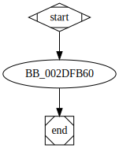

# sub_40FB60 function

## Tasks

- [X] Add Description.
- [ ] Add Syntax.
- [X] Add Assembly.
- [ ] Add Source.
- [ ] Add Arguments.
- [ ] Add Return Value.
- [X] Add Dependencies.
- [X] Add Used By.
- [X] Add Graph.
- [ ] Add Flow.
- [ ] Add Pseudo-code.
- [ ] Fully documented (Including dependencies).

## Description

This function possibly drops the icon file having the name [`aFkdjsadasdIco`](aFkdjsadasdIco.md) and size [`dword_487194`](dword_487194.md) contained in the memory location [`unk_46C628`](unk_46C628.md).

## Syntax

(Add syntax.)

## Assembly

Go to [assembly](../asm/sub_40FB60.asm).

## Source

Go to [source](../cc/sub_40FB60.cc).

## Arguments

(Add arguments.)

## Return Value

(Add return value.)

## Dependencies

* Function dependencies:
  * [`sub_41CD20`](sub_41CD20.md) ✔️
  * [`sub_406BD0`](sub_406BD0.md) ✔️
  * [`sub_402DC0`](sub_402DC0.md) ❓
  * [`sub_412C40`](sub_412C40.md) ✔️
  * [`sub_4067A0`](sub_4067A0.md) ✔️
  * [`sub_41BF50`](sub_41BF50.md) ❓
  * [`sub_41D3E0`](sub_41D3E0.md) ❓
  * [`sub_4176E0`](sub_4176E0.md) ❓
  * [`sub_414190`](sub_414190.md) ❓
  * [`sub_40B720`](sub_40B720.md) ❓
  * [`@__security_check_cookie@4`](@__security_check_cookie@4.md) ⌛

* Data dependencies:
  * [`aFkdjsadasdIco`](aFkdjsadasdIco.md) ✔️
  * [`dword_487194`](dword_487194.md) ✔️
  * [`unk_46C628`](unk_46C628.md) ✔️

## Used By

* Used by functions:
  * [`sub_40F650`](sub_40F650.md)

## Graph

## Flow

(Add flow.)

## Pseudo-code

(Add pseudo-code.)

