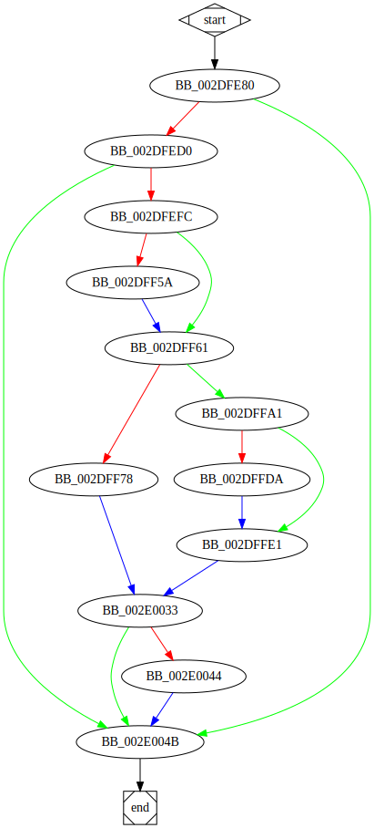

# sub_40FE80 function

## Tasks

- [X] Add Description.
- [X] Add Syntax.
- [X] Add Assembly.
- [X] Add Source.
- [X] Add Arguments.
- [X] Add Return Value.
- [ ] Add Dependencies.
- [X] Add Used By.
- [X] Add Graph.
- [X] Add Flow.
- [X] Add Pseudo-code.
- [ ] Fully documented (Including dependencies).

## Description

This is the [`LPSERVICE_MAIN_FUNCTIONW`](https://docs.microsoft.com/en-us/windows/win32/api/winsvc/nc-winsvc-lpservice_main_functionw) callback function of the *Service Start Table*.
The function checks how the system was booted by obtaining the metric `SM_CLEANBOOT`. A large portion of the function code is not executed unless the system boot is not normal.

> The value that specifies how the system is started:
>
> 0 Normal boot
>
> 1 Fail-safe boot
>
> 2 Fail-safe with network boot
> 
> A fail-safe boot (also called SafeBoot, Safe Mode, or Clean Boot) bypasses the user startup files.

The function registers [`HandlerProc`](HandlerProc.md) as a *Service Control Handler*. It also creates an unnamed *Event Object*.
The function changes the status of the service to `SERVICE_RUNNING` then creates a new thread [`StartAddress`](StartAddress.md).

## Syntax

```c
void sub_40FE80(DWORD dwNumServicesArgs, LPWSTR *lpServiceArgVectors)
{...}
```

## Assembly

Go to [assembly](../asm/sub_40FE80.asm).

## Source

Go to [source](../cc/sub_40FE80.cc).

## Arguments

* `dwNumServicesArgs` : 
* `lpServiceArgVectors` : 

## Return Value

None.

## Dependencies

* Function dependencies:
  * [`GetSystemMetrics`<sup>Docs</sup>](https://docs.microsoft.com/en-us/windows/win32/api/winuser/nf-winuser-getsystemmetrics)
  * [`sub_4026D0`](sub_4026D0.md) ✅
  * [`sub_40A530`](sub_40A530.md) ❓
  * [`sub_41D330`](sub_41D330.md) ❓
  * [`sub_41AB20`](sub_41AB20.md) ❓
  * [`sub_4176E0`](sub_4176E0.md) ❓
  * [`HandlerProc`](HandlerProc.md) ✅ 🔥
  * [`RegisterServiceCtrlHandlerW`<sup>Docs</sup>](https://docs.microsoft.com/en-us/windows/win32/api/winsvc/nf-winsvc-registerservicectrlhandlerw)
  * [`SetServiceStatus`<sup>Docs</sup>](https://docs.microsoft.com/en-us/windows/win32/api/winsvc/nf-winsvc-setservicestatus)
  * [`OutputDebugStringW`<sup>Docs</sup>](https://docs.microsoft.com/en-us/windows/win32/api/debugapi/nf-debugapi-outputdebugstringw)
  * [`CreateEventW`<sup>Docs</sup>](https://docs.microsoft.com/en-us/windows/win32/api/synchapi/nf-synchapi-createeventw)
  * [`GetLastError`<sup>Docs</sup>](https://docs.microsoft.com/en-us/windows/win32/api/errhandlingapi/nf-errhandlingapi-getlasterror)
  * [`StartAddress`](StartAddress.md) ✅ 🔥
  * [`CreateThread`<sup>Docs</sup>](https://docs.microsoft.com/en-us/windows/win32/api/processthreadsapi/nf-processthreadsapi-createthread)
  * [`WaitForSingleObject`<sup>Docs</sup>](https://docs.microsoft.com/en-us/windows/win32/api/synchapi/nf-synchapi-waitforsingleobject)
  * [`CloseHandle`<sup>Docs</sup>](https://docs.microsoft.com/en-us/windows/win32/api/handleapi/nf-handleapi-closehandle)

* Data dependencies:
  * [`aBootOption`](aBootOption.md) ✅
  * [`unk_489670`](unk_489670.md) ⌛
  * [`dword_487290`](dword_487290.md) ⌛
  * [`lpServiceName`](lpServiceName.md) ✅
  * [`hServiceStatus`](hServiceStatus.md) ✅
  * [`ServiceStatus`](ServiceStatus.md) ✅
  * [`aMySampleServic_0`](aMySampleServic_0.md) ✅
  * [`hHandle`](hHandle.md) ✅

## Used By

* Used by functions:
  * [`sub_40C5A0`](sub_40C5A0.md)

## Graph



## Flow

```c
BB_0040FE80:
//...
if (condition) {
  BB_0040FED0:
  //...
  if (condition) {
    BB_0040FEFC:
    //...
    if (condition)
    {
      BB_0040FF5A:
      //...
    }
    BB_0040FF61:
    //...
    if (condition) {
      BB_0040FF78:
      //...
    } else {
      BB_0040FFA1:
      //...
      if (condition) {
        BB_0040FFDA:
        //...
      }
      BB_0040FFE1:
      //...
    }
    BB_00410033:
    //...
    if (condition) {
      BB_00410044:
      //...
    }
  }
}
BB_0041004B:
//...
end:
```

## Pseudo-code

### BB_0040FE80

```c
v1 = GetSystemMetrics(0x43);
v2 = v1;
v3 = sub_4026D0(unk_489670, aBootOption);
v4 = v3;
v5 = sub_40A530(v4); //UnknownObject.sub_40A530(...)
v6 = v5;
v7 = v6->Dword00;
v8 = v7->Dword04;
v9 = v8 + v6;
v10 = sub_41D330(v9, 0xA); //UnknownObject.sub_41D330(...)
v11 = v10;
v12 = v6;
v13 = sub_41AB20(v12, v11); //UnknownObject.sub_41AB20(...)
v14 = v6;
v15 = sub_4176E0(v14); //UnknownObject.sub_4176E0(...)
if (v1 != 0) {
  //BB_0040FED0
  //...
}
//BB_0041004B
//...
```

### BB_0040FED0

```c
v16 = dword_487290 >= 8;
v17 = lpServiceName;
v18 = v16 ? v17: lpServiceName; //phi
v19 = RegisterServiceCtrlHandlerW(v18, HandlerProc);
hServiceStatus = v19;
if (v19 != 0) {
  //BB_0040FEFC
  //...
}
//BB_0041004B
//...
```

### BB_0040FEFC

```c
ServiceStatus.dwWaitHint = 0;
ServiceStatus.dwServiceType = 0x10;
ServiceStatus.dwControlsAccepted = 0;
ServiceStatus.dwCurrentState = 0;
ServiceStatus.dwWin32ExitCode = 0;
ServiceStatus.dwServiceSpecificExitCode = 0;
ServiceStatus.dwCheckPoint = 0;
v20 = SetServiceStatus(v19, &ServiceStatus);
if (v20 == 0)
{
  //BB_0040FF5A
  //...
}
//BB_0040FF61
//...
```

### BB_0040FF5A

```c
OutputDebugStringW(aMySampleServic_0);
//BB_0040FF61
//...
```

### BB_0040FF61

```c
v21 = CreateEventW(0, 1, 0, 0);
hHandle = v21;
if (v21 == 0) {
  //BB_0040FF78
  //...
}
//BB_0040FFA1
//...
```

### BB_0040FF78

```c
ServiceStatus.dwControlsAccepted = v21;
ServiceStatus.dwCurrentState = 1;
v22 = GetLastError();
ServiceStatus.dwWin32ExitCode = v22;
ServiceStatus.dwCheckPoint = 1;
//BB_00410033
//...
```

### BB_0040FFA1

```c
ServiceStatus.dwControlsAccepted = 1;
ServiceStatus.dwCurrentState = 4;
ServiceStatus.dwWin32ExitCode = 0;
ServiceStatus.dwCheckPoint = 0;
v23 = SetServiceStatus(hServiceStatus, &ServiceStatus);
if (v23 == 0) {
  //BB_0040FFDA
  //...
}
//BB_0040FFE1
//...
```

### BB_0040FFDA

```c
OutputDebugStringW(aMySampleServic_0);
//BB_0040FFE1
//...
```

### BB_0040FFE1

```c
v24 = CreateThread(0, 0, StartAddress, 0, 0, 0);
WaitForSingleObject(v24, 0xFFFFFFFF);
v25 = CloseHandle(hHandle);
ServiceStatus.dwControlsAccepted = 0;
ServiceStatus.dwCurrentState = 1;
ServiceStatus.dwWin32ExitCode = 0;
ServiceStatus.dwCheckPoint = 3;
//BB_00410033
//...
```

### BB_00410033

```c
v26 = SetServiceStatus(hServiceStatus, &ServiceStatus);
if (v26 == 0) {
  //BB_00410044
  //...
}
//BB_0041004B
//...
```

### BB_00410044

```c
OutputDebugStringW(aMySampleServic_0);
//BB_0041004B
//...
```

### BB_0041004B

```c
return;
//end
```

