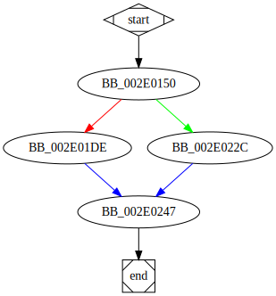

# sub_410150 function

## Tasks

- [ ] Add Description.
- [ ] Add Syntax.
- [X] Add Assembly.
- [ ] Add Source.
- [ ] Add Arguments.
- [ ] Add Return Value.
- [X] Add Dependencies.
- [X] Add Used By.
- [X] Add Graph.
- [ ] Add Flow.
- [ ] Add Pseudo-code.
- [ ] Fully documented (Including dependencies).

## Description

This function possibly assigns an icon to files having the extension [`aBasta_0`](aBasta_0.md).

## Syntax

(Add syntax.)

## Assembly

Go to [assembly](../asm/sub_410150.asm).

## Source

Go to [source](../cc/sub_410150.cc).

## Arguments

(Add arguments.)

## Return Value

(Add return value.)

## Dependencies

* Function dependencies:
  * [`sub_402E70`](sub_402E70.md) ❓
  * [`RegCreateKeyExW`Docs](https://docs.microsoft.com/en-us/windows/win32/api/winreg/nf-winreg-regcreatekeyexw)
  * [`RegSetValueExW`Docs](https://docs.microsoft.com/en-us/windows/win32/api/winreg/nf-winreg-regsetvalueexw)
  * [`SHChangeNotify`Docs](https://docs.microsoft.com/en-us/windows/win32/api/shlobj_core/nf-shlobj_core-shchangenotify)
  * [`FormatMessageW`Docs](https://docs.microsoft.com/en-us/windows/win32/api/winbase/nf-winbase-formatmessagew)
  * [`sub_412C40`](sub_412C40.md) ✔️
  * [`@__security_check_cookie@4`](@__security_check_cookie@4.md) ⌛

* Data dependencies:
  * [`aDefaulticon`](aDefaulticon.md) ✔️
  * [`aBasta_0`](aBasta_0.md) ✔️
  * [`ValueName`](ValueName.md) ⌛

## Used By

* Used by functions:
  * [`sub_40F650`](sub_40F650.md)

## Graph

## Flow

(Add flow.)

## Pseudo-code

(Add pseudo-code.)

