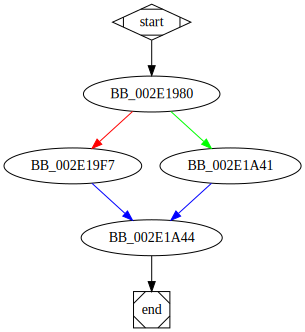

# sub_411980 function

## Tasks

- [ ] Add Description.
- [ ] Add Syntax.
- [X] Add Assembly.
- [ ] Add Source.
- [ ] Add Arguments.
- [ ] Add Return Value.
- [X] Add Dependencies.
- [X] Add Used By.
- [X] Add Graph.
- [ ] Add Flow.
- [ ] Add Pseudo-code.
- [ ] Fully documented (Including dependencies).

## Description

(Add description.)

## Syntax

(Add syntax.)

## Assembly

Go to [assembly](../asm/sub_411980.asm).

## Source

Go to [source](../cc/sub_411980.cc).

## Arguments

(Add arguments.)

## Return Value

(Add return value.)

## Dependencies

* Function dependencies:
  * [`__get_stream_buffer_pointers`](__get_stream_buffer_pointers.md) ⌛

* Data dependencies:
  * [`dword_489360`](dword_489360.md) ⌛
  * [`dword_489364`](dword_489364.md) ⌛

## Used By

* Used by functions:
  * [`sub_419970`](sub_419970.md)

## Graph

## Flow

(Add flow.)

## Pseudo-code

(Add pseudo-code.)

