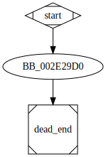

# sub_4129D0 function

## Tasks

- [ ] Add Description.
- [ ] Add Syntax.
- [ ] Add Assembly.
- [ ] Add Source.
- [ ] Add Arguments.
- [ ] Add Return Value.
- [ ] Add Dependencies.
- [ ] Add Used By.
- [ ] Add Graph.
- [ ] Add Flow.
- [ ] Add Pseudo-code.
- [ ] Fully documented (Including dependencies).

## Description

This function unconditionally raises an exception by calling the function [`sub_4398A0`](sub_4398A0.md).

## Syntax

```c

```

## Assembly

Go to [assembly](../asm/sub_4129D0.asm).

## Source

Go to [source](../cc/sub_4129D0.cc).

## Arguments


## Return Value

(Add return value.)

## Dependencies

* Function dependencies:
  * [`sub_407A00`](sub_407A00.md)
  * [`sub_4398A0`](sub_4398A0.md)

* Data dependencies:
  * `__TI3?AVbad_array_new_length@std@@`

## Used By

* Used by functions:
  * [`sub_413350`](sub_413350.md)

## Graph



